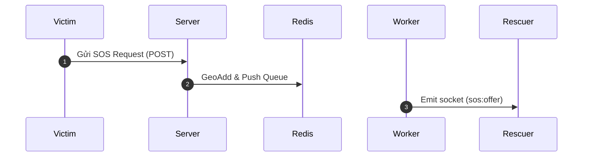

# Chuyên Gia Viết Tài Liệu & Sơ Đồ Kiến Trúc (Documentation Writer) ⭐⭐⭐⭐☆

Kỹ năng này hướng dẫn AI tự động bổ sung và cập nhật tài liệu kỹ thuật sau mỗi lần hoàn thành một tính năng hoặc refactor hệ thống lớn.

---

## 📝 Các Loại Tài Liệu Cần Sinh (Generated Artifacts)

### 1. Tài liệu API (API Documentation)
- Mô tả URL, Endpoint, HTTP Method, Headers.
- Ví dụ Request Body (JSON) và Response thành công / thất bại.

### 2. Sơ đồ Luồng (Sequence & Architecture Diagrams với Mermaid)
- Sử dụng cú pháp Mermaid để trực quan hóa luồng dữ liệu giữa Victim, Server, Redis, Database và Rescuer.

### 3. Cập nhật README & Ví dụ sử dụng
- Hướng dẫn cài đặt, biến môi trường `.env`, lệnh chạy dev/test.
- Cung cấp ví dụ sử dụng hàm / widget ngắn gọn, dễ hiểu.
