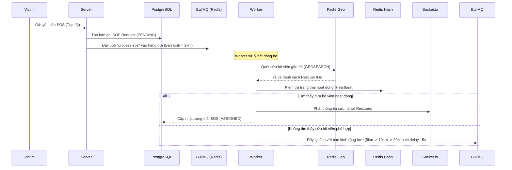

# BÁO CÁO KỸ THUẬT: KIẾN TRÚC HỆ THỐNG, CÔNG NGHỆ VÀ GIẢI PHÁP TỐI ƯU HÓA THỜI GIAN THỰC

Báo cáo này mô tả chi tiết sơ đồ kiến trúc, các công nghệ sử dụng và các giải pháp tối ưu hóa hiệu năng được triển khai trong hệ thống **Cứu hộ khẩn cấp SOS**. Đây là tài liệu phục vụ cho nội dung báo cáo đồ án tốt nghiệp.

---

## I. Công Nghệ Sử Dụng (Technology Stack)

Hệ thống được thiết kế theo mô hình Monorepo, tích hợp các công nghệ hiện đại, tối ưu cho việc xử lý thời gian thực và dữ liệu lớn:

| Thành phần | Công nghệ | Vai trò trong hệ thống |
|---|---|---|
| **Backend API** | Node.js & Express.js | Xử lý nghiệp vụ chính, cung cấp RESTful API, tổ chức theo kiến trúc Layered Modular. |
| **Real-time Server**| Socket.io (Websocket) | Thiết lập kết nối hai chiều liên tục giữa Server với Mobile App và Web Admin. |
| **Database chính** | PostgreSQL (v13+) | Lưu trữ dữ liệu có cấu trúc, quan hệ bền vững (Users, Profiles, SOS Requests, Notifications...). |
| **In-Memory Cache** | Redis (v6+) | Lưu trữ dữ liệu vị trí thời gian thực (Geo Spatial), Cache trạng thái (Heartbeat), Pub/Sub và Hàng đợi. |
| **Background Queue**| BullMQ | Quản lý và xử lý hàng đợi tìm kiếm cứu hộ viên bất đồng bộ (Background Workers). |
| **Mobile App** | Flutter & Dart | Ứng dụng di động đa nền tảng cho Cứu hộ viên và Nạn nhân, hỗ trợ định vị chạy nền. |
| **Web Admin** | React, Vite, Tailwind v4 | Giao diện quản trị viên điều phối, tích hợp bản đồ Leaflet theo dõi trực quan. |

---

## II. Luồng Nghiệp Vụ Cốt Lõi (Core Workflows)

### 1. Luồng Cập Nhật Định Vị Chạy Ngầm (Background Location Tracking)
Để theo dõi vị trí của Cứu hộ viên mà không làm cạn kiệt pin thiết bị di động:
1. **Thiết bị (Flutter Background Service):** Cứ mỗi 5-15 giây, dịch vụ chạy ngầm sẽ lấy vị trí từ GPS (ưu tiên lấy từ cache hệ điều hành `getLastKnownPosition` trước để tránh timeout và tiết kiệm pin).
2. **Lọc khoảng cách di chuyển:** Thiết bị tính khoảng cách so với lần gửi trước. Chỉ khi cứu hộ viên di chuyển **trên 10 mét** thì mới phát tín hiệu socket `rescuer:location:update` lên Server.
3. **Server (Express & Redis):** Nhận sự kiện từ socket, lưu trữ trực tiếp tọa độ (Kinh độ/Vĩ độ) của cứu hộ viên vào tập hợp không gian địa lý **Redis Geo** (`geoadd`) với key `rescuer_locations`.

### 2. Luồng Tiếp Nhận & Ghép Đôi Cứu Hộ Bất Đồng Bộ (SOS Matching Process)
Khi nạn nhân phát tín hiệu khẩn cấp SOS:

---

## III. Các Giải Pháp Tối Ưu Hóa Hiệu Năng (Performance Optimizations)

Đây là những điểm cải tiến kỹ thuật quan trọng giúp hệ thống hoạt động ổn định ở quy mô lớn:

### 1. Triệt tiêu tải ghi (Write I/O) lên Database PostgreSQL
* **Vấn đề:** Thiết bị di động gửi tín hiệu Heartbeat (`rescuer:heartbeat`) và Tọa độ (`location:update`) liên tục (15s/lần) để báo cáo trạng thái trực tuyến. Nếu ghi trực tiếp vào PostgreSQL bằng các câu lệnh `UPDATE` liên tục, DB sẽ nhanh chóng bị quá tải và khóa tài nguyên (Database Lock).
* **Giải pháp tối ưu:** 
  * Cập nhật thời điểm hoạt động cuối (`last_seen_at`) của cứu hộ viên vào một **Redis Hash Map** (`rescuer:last_seen`).
  * Chỉ thực hiện câu lệnh `UPDATE` ghi nhận xuống DB PostgreSQL **một lần duy nhất** khi cứu hộ viên chính thức chuyển sang trạng thái ngoại tuyến (`goOffline` - do chủ động bấm nút hoặc do ngắt kết nối socket quá 15 giây).
  * Trong suốt phiên làm việc, PostgreSQL hoàn toàn được giải phóng khỏi tải ghi heartbeat.

### 2. Thuật toán Matching chạy 100% trên bộ nhớ RAM (Redis Bypass DB)
* **Vấn đề:** Lớp xử lý ghép đôi (`matchingService`) cần liên tục kiểm tra khoảng cách địa lý và thời gian hoạt động của cứu hộ viên. Việc truy vấn SQL sang PostgreSQL để đọc bảng profile cho danh sách cứu hộ viên quét được sẽ gây chậm trễ (độ trễ I/O lớn).
* **Giải pháp tối ưu:** 
  * Lấy danh sách cứu hộ viên trong bán kính bằng lệnh `GEOSEARCH` trên Redis Geo.
  * Lấy thời gian hoạt động cuối (`last_seen_at`) của toàn bộ danh sách cứu hộ viên thông qua lệnh `HMGET` trên Redis Hash Map.
  * Việc so sánh khoảng cách, lọc các cứu hộ viên khả dụng và sắp xếp gần nhất diễn ra hoàn toàn trên bộ nhớ RAM của Redis (tốc độ xử lý dưới 5ms). Không có bất kỳ truy vấn PostgreSQL nào được kích hoạt trong luồng này.

### 3. Xử lý hàng đợi bất đồng bộ với BullMQ (Non-blocking I/O)
* Việc tìm kiếm cứu hộ viên theo cơ chế lan tỏa (tăng dần bán kính từ 2km -> 5km -> 10km -> 20km sau mỗi 15s) được quản lý thông qua **BullMQ**.
* Điều này giúp Server API chính không bị nghẽn (blocking) khi phải thực hiện các vòng lặp chờ đợi (delay) tìm kiếm cứu hộ. Luồng chính vẫn nhận các request API khác bình thường, việc tính toán ghép đôi do các Worker chạy ngầm đảm nhận.

### 4. Kiến trúc Redis Pub/Sub phục vụ Scale-out
* Khi hệ thống mở rộng, chạy nhiều container/server Websocket (Socket.io) khác nhau, các socket client có thể kết nối ở các server khác nhau.
* Hệ thống tích hợp **Redis Pub/Sub** (`redis.publish` và `redis.duplicate()`) để làm kênh truyền tin trung gian (Event Broker). Khi một sự kiện cứu hộ được phát ra, Redis Pub/Sub sẽ đồng bộ tín hiệu và truyền tải đến đúng Socket client ở bất kỳ server nào mà họ đang kết nối.
