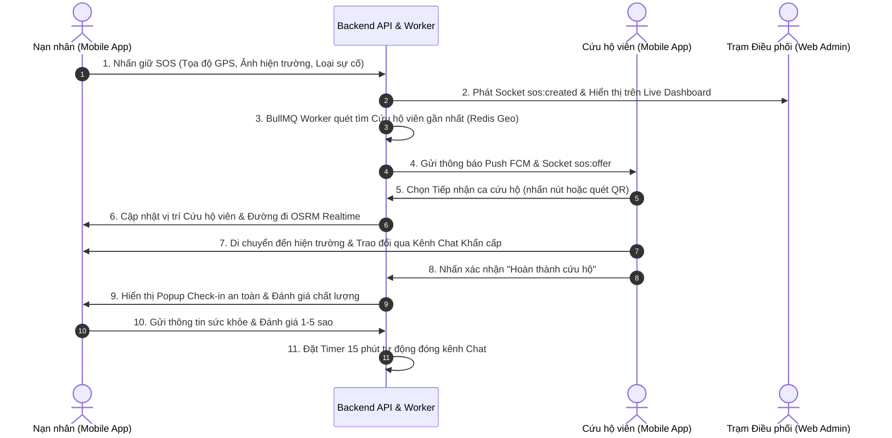
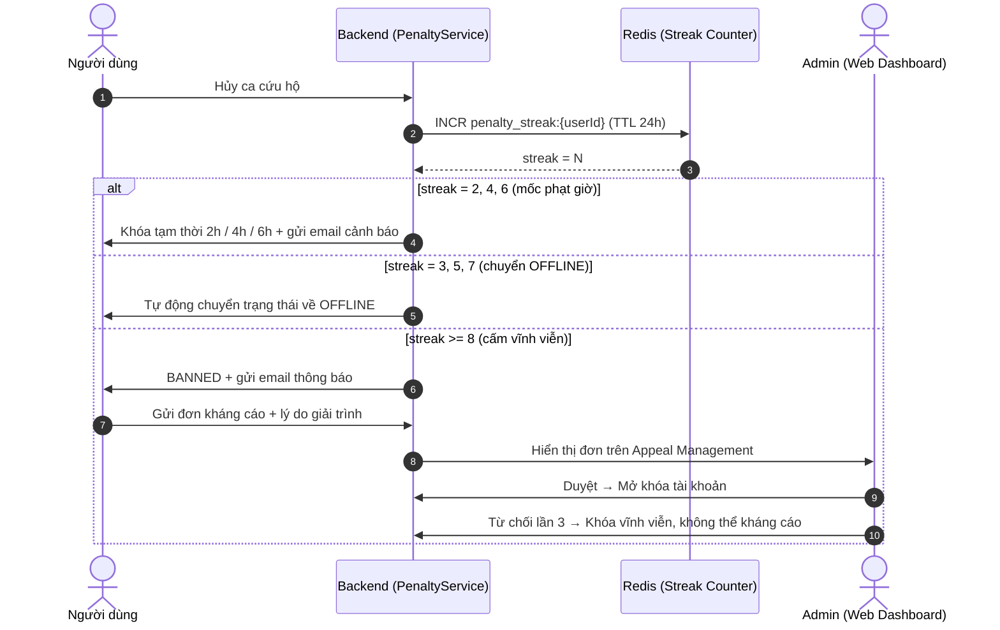
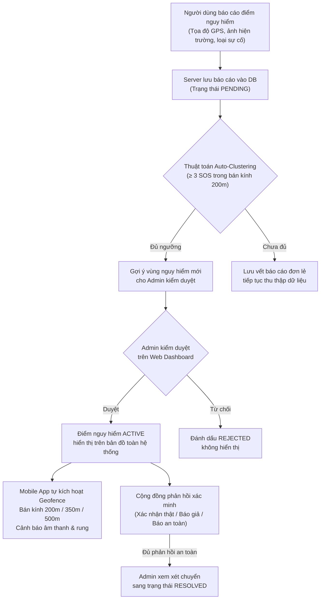

# BÁO CÁO REVIEW VÀ TỔNG KẾT DỰ ÁN TỐT NGHIỆP

> **Tên dự án:** Xây dựng hệ thống cứu hộ khẩn cấp thời gian thực dựa trên định vị GPS và cơ chế thông báo tức thời
> **Kiến trúc:** Monorepo gồm `server/` (Express.js), `web/` (React + Vite), `mobile/` (Flutter)
> **Trạng thái:** 🔥 **Đã hoàn thiện 100% tất cả các nền tảng & sẵn sàng vận hành**
> **Cập nhật:** 08/2026

---

## I. Tổng quan Sản phẩm Cứu hộ Khẩn cấp

Dự án đã phát triển và hoàn thiện thành công hệ thống sinh thái cứu hộ khẩn cấp toàn diện gồm 3 lớp nền tảng chính:

1. **Backend Server (`server/`)**: Xây dựng theo kiến trúc Layered Modular tiên tiến, tích hợp CSDL PostgreSQL, Redis Geo & Pub/Sub, BullMQ Message Queue, Socket.io thời gian thực và trí tuệ nhân tạo Groq Cloud AI.
2. **Mobile Application (`mobile/`)**: Ứng dụng Flutter dành riêng cho Nạn nhân (Victim) và Cứu hộ viên (Rescuer) với kiến trúc Feature-First Clean Architecture, tối ưu hóa giao diện cho các tình huống khẩn cấp ngoài hiện trường.
3. **Web Admin Dashboard (`web/`)**: Trang quản trị React/Vite tích hợp TailwindCSS theo tone màu xám đen hiện đại, cung cấp bộ công cụ điều phối toàn diện bao gồm theo dõi Heatmap điểm nóng, kiểm duyệt AI, quản trị người dùng, phát thông báo đẩy và trích xuất báo cáo vận hành thời gian thực.

### I.1 Giải trình Tên Đề tài & Phạm vi (Phản hồi Hội đồng)

Tên đề tài **"Xây dựng hệ thống cứu hộ khẩn cấp thời gian thực dựa trên định vị GPS và cơ chế thông báo tức thời"** được xác lập dựa trên 3 yếu tố định phạm vi rõ ràng:

| Yếu tố | Thể hiện trong tên | Minh chứng trong hệ thống |
|---|---|---|
| **Đối tượng** | *Hệ thống cứu hộ khẩn cấp* | 2 vai trò tương tác chính: Nạn nhân (Victim) & Cứu hộ viên (Rescuer); cùng đơn vị quản trị điều phối (Admin) |
| **Công nghệ cốt lõi** | *Định vị GPS* + *Thông báo tức thời* | Redis Geo định vị đa bán kính, Socket.io thời gian thực, FCM Push Notification, OSRM routing dẫn đường |
| **Phạm vi triển khai** | *Thời gian thực* | Sinh thái 3 nền tảng đồng bộ: Mobile App (Flutter), Web Admin Dashboard (React), Backend Server (Express.js) |

Tên đề tài **giới hạn rõ ràng** trong phạm vi cứu hộ khẩn cấp và định vị thực địa, không kéo dài sang các bài toán ngoài phạm vi như thương mại dịch vụ hay quản lý giao thông đô thị tổng thể.

---

## II. Kiến trúc Kỹ thuật & Hạ tầng

### Stack Công nghệ

| Thành phần | Công nghệ |
|---|---|
| Backend | Node.js 22 + Express.js (Layered Modular Architecture) |
| Database | PostgreSQL (UUID primary keys, DOUBLE PRECISION coordinates) |
| Cache & Geo | Redis — GEOADD/GEORADIUS định vị + Pub/Sub channel nội bộ |
| Queue | BullMQ (ioredis) — job hủy SOS, job phạt cứu hộ viên |
| Realtime | Socket.io — bidirectional communication |
| Mobile | Flutter (Dart) — Feature-First Clean Architecture |
| Web Admin | React 18 + Vite + TailwindCSS |
| AI | Groq Cloud API (Llama 3.3 70B) |
| Navigation | OSRM — self-hosted routing engine |
| Auth | JWT Access Token + Refresh Token (httpOnly cookie) |
| Push | Firebase Cloud Messaging (FCM) |
| Storage | Cloudinary — ảnh hiện trường, ảnh tiện ích |
| Email | Nodemailer — OTP xác thực, thông báo phạt tài khoản |
| Deployment | Docker + Docker Compose (dev & production), Vercel (web) |

---

## III. Kết quả Triển khai Chi tiết theo Nền tảng

### 1. Backend Server (`server/`)

#### 1.1 Xác thực & Tài khoản (Auth & User)
- **Đăng ký / Đăng nhập**: JWT Access Token + Refresh Token httpOnly cookie, đăng nhập Google Sign-In OAuth2.
- **Xác thực OTP qua Email**: Gửi mã OTP 6 chữ số qua Nodemailer với kiểm tra thời hạn hết hạn.
- **Quản lý Hồ sơ**: Cập nhật thông tin cá nhân, avatar upload lên Cloudinary.
- **Quản lý mật khẩu**: Đổi mật khẩu, quên mật khẩu qua OTP email.
- **Phân quyền**: Middleware `verifyToken` + `isAdmin` + `isNotBanned` theo vai trò.

#### 1.2 Quản lý Cứu hộ viên (Rescuer)
- **Đăng ký & Xét duyệt hồ sơ**: Cứu hộ viên nộp hồ sơ kèm chứng chỉ kỹ năng, Admin phê duyệt qua Web Dashboard.
- **Trạng thái Online/Offline**: Cứu hộ viên tự chuyển trạng thái sẵn sàng nhận ca.
- **Phân tích Hiệu suất**: API thống kê số ca hoàn thành, thời gian phản hồi trung bình, điểm đánh giá trung bình.

#### 1.3 Tạo & Phát Yêu cầu Khẩn cấp (SOS & Multi-channel)
- Phát yêu cầu SOS kèm ảnh hiện trường (Cloudinary), tọa độ GPS và loại sự cố.
- **BullMQ job timeout 30 phút**: Tự động hủy SOS và thông báo nạn nhân nếu không có cứu hộ viên.
- **QR Fallback**: Nạn nhân tạo mã QR chứa SOS ID, Cứu hộ viên quét xác nhận nhận ca khi offline.

#### 1.4 Thuật toán Ghép đôi & Định vị (Matching & Location)
- **Geo Matching đa vòng bán kính**: Redis GEORADIUS mở rộng dần `2km → 5km → 10km → 20km`.
- **GPS realtime**: Socket phát tọa độ GPS cứu hộ viên đến nạn nhân khi di chuyển.
- **Bán kính cấu hình động**: Admin thay đổi qua System Settings không cần restart server.

#### 1.5 Điều phối & Trao đổi Khẩn cấp (Dispatch, Chat & FCM)
- Gửi lời mời nhận ca đến cứu hộ viên qua Socket + FCM Push Notification đồng thời.
- Kênh nhắn tin realtime giữa nạn nhân và cứu hộ viên, tự động khóa sau 15 phút kết thúc ca.

#### 1.6 Phát hiện Vùng Rủi ro Tự động (Crowd-Sourced Hazard Clustering)
- Thuật toán tự động quét mật độ dữ liệu SOS (≥ 3 ca trong bán kính 200m) để gợi ý vùng nguy hiểm mới cho Admin duyệt.

#### 1.7 Tiếp nhận Phản hồi Xác minh Điểm Nguy hiểm (Community Verification)
- Thu thập phản hồi đa chiều: **Xác nhận thật / Báo giả mạo / Báo đã an toàn / Xác nhận nguy hiểm**.

#### 1.8 Quản lý Bản đồ Tiện ích Khẩn cấp (Emergency Amenities)
- Quản lý bệnh viện, trạm xăng, điểm sửa xe, tiếp nhận báo cáo vi phạm.
- **Duplicate Detection & Merge**: Tự động phát hiện và gộp địa điểm trùng lặp.

#### 1.9 Quản lý Loại Sự cố (Incident Type Management) ⭐
- CRUD đầy đủ loại sự cố khẩn cấp (tai nạn giao thông, hỏa hoạn, đột quỵ, v.v.).
- Icon và màu sắc đi kèm để hiển thị trực quan trên bản đồ.

#### 1.10 Trích xuất Báo cáo Vận hành (Reports Export)
- API xuất CSV/Excel (UTF-8 BOM chuẩn font Việt) toàn bộ nhật ký ca cứu hộ, mốc thời gian và GPS.

#### 1.11 Hậu xử lý & Xác nhận An toàn (Post-Rescue Safety Check-in)
- Tiếp nhận trạng thái sức khỏe nạn nhân và điểm đánh giá 1-5 sao.

#### 1.12 Kiểm duyệt AI Moderation & Từ điển Từ cấm
- **Groq Cloud API (Llama 3.3 70B)** + từ điển local `blacklisted_phrases`.
- Cơ chế **non-blocking**: Từ điển local chặn tức thì 0-token, AI chỉ gọi khi cần phán quyết phức tạp.
- Admin bật/tắt qua System Settings realtime.

#### 1.13 AI Executive Summarization & Sentiment Analysis
- Phân tích chỉ số vận hành 7-30 ngày, sinh báo cáo tóm tắt điều hành cho Admin.
- Phân tích cảm xúc (Tích cực / Trung lập / Tiêu cực) cho mọi đánh giá chất lượng.

#### 1.14 Hệ thống Vi phạm & Hình phạt (Penalty System) ⭐
- **Thang phạt tăng dần**: Hủy ca liên tiếp bị khóa tạm thời `2h → 4h → 6h → 8h`.
- **Tự động chuyển OFFLINE**: Từ lần hủy thứ 3, cứu hộ viên tự động chuyển về OFFLINE.
- **Cấm vĩnh viễn**: Đạt 8 lần hủy liên tiếp → tài khoản bị BANNED.
- **Redis Pub/Sub**: Phát sự kiện `rescuer:suspended` để client nhận ngay lập tức.
- **Email cảnh báo**: Tự động gửi email thông báo phạt và thời gian mở khóa.

#### 1.15 Hệ thống Kháng cáo (Appeal System) ⭐
- Người dùng bị khóa gửi đơn kháng cáo kèm lý do giải trình.
- **Giới hạn 3 lần**: Bị từ chối kháng cáo 3 lần → khóa vĩnh viễn.
- Admin xem đơn, ghi chú nội bộ, Duyệt/Từ chối trong database transaction.

#### 1.16 Phát Thông báo (Notification Broadcast) ⭐
- Admin soạn và gửi push notification đến toàn bộ / nhóm Cứu hộ viên / nhóm Nạn nhân theo loại (Khẩn cấp / Cảnh báo / Hệ thống / Tin tức).
- Nhật ký lịch sử thông báo đã gửi với số người nhận, loại, thời gian.

#### 1.17 Phản hồi Ứng dụng (App Feedback) ⭐
- Người dùng gửi phản hồi/góp ý về ứng dụng qua API.
- Admin xem và quản lý danh sách phản hồi trên Web Dashboard.

#### 1.18 Khóa tài khoản & Bảo mật
- Middleware `isNotBanned` chặn API tức thì, tự động ép đăng xuất client khi HTTP 403.
- Socket middleware xác thực JWT trước mọi kết nối Socket.io.

---

### 2. Mobile Application (`mobile/`)

#### 2.1 Xác thực & Tài khoản
- Đăng ký, đăng nhập email/password, Google Sign-In OAuth2.
- **Quên mật khẩu qua OTP**: email → OTP 6 chữ số → đặt mật khẩu mới với đếm ngược thời gian.

#### 2.2 Trải nghiệm SOS Khẩn cấp (Victim)
- **Nút nhấn giữ 2 giây**: Animation vòng tròn tiến trình, hủy ngay khi thả tay.
- Gửi SOS kèm ảnh hiện trường, GPS chính xác. Theo dõi realtime vị trí cứu hộ viên, ETA và đường đi.

#### 2.3 Nhận ca Cứu hộ (Rescuer)
- Màn hình bản đồ cứu hộ viên với đường đi OSRM và cập nhật GPS liên tục.
- **Đăng ký hồ sơ Cứu hộ viên**: Form đăng ký kỹ năng, chờ Admin phê duyệt.
- **QR Scanner**: Quét mã QR từ nạn nhân để nhận ca khi offline.

#### 2.4 Kênh Liên hệ Đa phương thức
- Gọi 115/114/113/112 trực tiếp, gửi SMS đính kèm vị trí Google Maps, lưu số người thân khẩn cấp.

#### 2.5 Dẫn đường & ETA Thời gian thực
- OSRM nội bộ, cập nhật ETA và khoảng cách tự động khi di chuyển.

#### 2.6 Geofencing & Cảnh báo Vùng Nguy hiểm
- Âm thanh/rung theo bán kính: **Cao 500m / Trung bình 350m / Thấp 200m**.
- Bán kính đồng bộ cấu hình Admin realtime.

#### 2.7 Bản đồ Tiện ích & Smart Search
- Tìm kiếm theo GPS, chỉ đường OSRM đến tiện ích.
- **Quản lý Tiện ích của tôi**: Xem và quản lý địa điểm do người dùng đóng góp. ⭐

#### 2.8 Điểm Nguy hiểm (Dangerous Points) ⭐
- **Quản lý báo cáo của tôi**: Theo dõi trạng thái các điểm nguy hiểm đã báo cáo (chờ duyệt / đã duyệt / từ chối).

#### 2.9 Kênh Chat Khẩn cấp
- Danh sách hội thoại và giao diện chat realtime, gửi text và ảnh.
- Tự động khóa sau 15 phút kết thúc ca.

#### 2.10 Hậu xử lý & Đánh giá
- Popup **Post-Rescue Check-in Sheet** tự động sau ca cứu hộ, đánh giá 1-5 sao.

#### 2.11 Lịch sử Ca cứu hộ (History) ⭐
- Toàn bộ lịch sử ca SOS (thời gian, địa điểm, cứu hộ viên, trạng thái).
- Lọc theo trạng thái: Hoàn thành / Đã hủy / Hết hạn.

#### 2.12 Thông báo In-App (Notification) ⭐
- Lịch sử thông báo đẩy đã nhận từ hệ thống với loại, nội dung, thời gian.

#### 2.13 Hồ sơ Cá nhân (Profile) ⭐
- Xem thông tin cá nhân, avatar; chỉnh sửa và cập nhật ảnh đại diện.

#### 2.14 Cài đặt Ứng dụng (Settings) ⭐
- Cài đặt thông báo, số điện thoại người thân, bảo mật (đổi mật khẩu, đăng xuất).

#### 2.15 Báo cáo Sự cố Ứng dụng (App Report) ⭐
- Gửi báo cáo lỗi/góp ý. Xem lại lịch sử báo cáo đã gửi và trạng thái xử lý.

#### 2.16 Trung tâm Hỗ trợ (Help Center) ⭐
- Hướng dẫn sử dụng, FAQ và thông tin liên hệ hỗ trợ.

#### 2.17 Thông tin Ứng dụng (App Info) ⭐
- Phiên bản, nhà phát triển, điều khoản dịch vụ, chính sách quyền riêng tư.

#### 2.18 Khả năng Chống chịu Mạng yếu (Offline Resiliency)
- Hàng đợi lưu tin nhắn/định vị offline, tự đồng bộ khi có mạng.
- Tự động refresh Socket và Refresh Token khi hết hạn.

---

### 3. Web Admin Dashboard (`web/`)

#### 3.1 Live Dashboard Realtime
- Socket.io theo dõi diễn biến ca SOS tức thì, chỉ số tổng quan và Toast notification.

#### 3.2 Bản đồ Heatmap Điểm nóng
- Mật độ sự cố với intensity động, tự động fit khung nhìn.

#### 3.3 Kênh Hỗ trợ Đa Admin (Support Chat)
- Tổng đài chat nổi toàn trang, Admin tiếp nhận hỗ trợ nạn nhân realtime.

#### 3.4 AI Tóm tắt Điều hành
- 1-click kích hoạt Llama 3.3 tóm tắt vận hành và khuyến nghị điều phối.

#### 3.5 Quản lý Tiện ích & Điểm Nguy hiểm
- Kiểm duyệt, gỡ bỏ địa điểm vi phạm, gộp địa điểm trùng lặp.

#### 3.6 Trang AI Moderation
- Danh sách nội dung vi phạm, xem cụm từ nhạy cảm, Duyệt/Bác bỏ.

#### 3.7 Phân tích Chất lượng & Cảm xúc AI
- Lọc 1-5 sao, lọc cảm xúc AI và biểu đồ xu hướng.

#### 3.8 Quản lý Cứu hộ viên & Analytics ⭐
- **Tab Danh sách**: Tìm kiếm, xét duyệt hồ sơ cứu hộ viên chờ phê duyệt.
- **Tab Hiệu suất**: Dashboard phân tích từng cứu hộ viên — tổng ca, thời gian phản hồi, điểm đánh giá, xếp hạng.
- Chỉ số tổng quan: tổng cứu hộ viên, tổng ca, thời gian & điểm trung bình toàn hệ thống.

#### 3.9 Quản lý Người dùng (User Management) ⭐
- Danh sách tài khoản với phân trang, tìm kiếm, lọc trạng thái.

#### 3.10 Quản lý Đơn Kháng cáo (Appeal Management) ⭐
- Lọc trạng thái (Chờ xử lý / Đã duyệt / Từ chối), xem lý do kháng cáo, ghi chú nội bộ, Duyệt/Từ chối.

#### 3.11 Phát Thông báo (Notification Broadcast) ⭐
- Soạn và gửi push notification đến toàn bộ / Cứu hộ viên / Nạn nhân theo loại.
- Nhật ký lịch sử thông báo đã gửi.

#### 3.12 Quản lý Loại Sự cố (Incident Type) ⭐
- CRUD loại sự cố: thêm mới, sửa thông tin, icon và màu sắc.

#### 3.13 Phản hồi Người dùng (App Feedback) ⭐
- Xem danh sách phản hồi/góp ý từ người dùng.

#### 3.14 Hồ sơ Admin (Profile)
- Admin xem và cập nhật thông tin cá nhân.

#### 3.15 Cấu hình Hệ thống Realtime (System Settings)
- 4 Tab: **Bán kính điều phối / Bán kính Geofence / AI Moderation / Hotline khẩn cấp**.
- Có hiệu lực ngay lập tức, không cần restart Server.

---

## IV. Luồng Cứu hộ Khẩn cấp Cốt lõi

---

## V. Luồng Vi phạm & Kháng cáo (Penalty & Appeal Flow) ⭐

---

## VI. Kiến trúc Socket.io Events & Redis Pub/Sub

| Event / Channel | Chiều | Mô tả |
|---|---|---|
| `sos:created` | Server → Admin | SOS mới được tạo |
| `sos:offer` | Server → Rescuer | Mời nhận ca |
| `sos:accepted` | Server → Victim | Cứu hộ viên đã nhận |
| `sos:location_update` | Server → Victim | Cập nhật tọa độ GPS |
| `sos:completed` | Server → All | Ca hoàn thành |
| `sos:cancelled` | Server → All | Ca bị hủy |
| `sos:expired` | Server → Victim | Ca hết hạn 30 phút |
| `chat:message` | Bidirectional | Tin nhắn chat realtime |
| `rescuer:suspended` | Redis Pub/Sub → Server | Phạt cứu hộ viên nội bộ |
| `user:banned` | Server → Client | Tài khoản bị khóa |
| `user:kicked` | Server → Admin | Admin bị ép đăng xuất |

---

## VII. Triển khai & DevOps

- **Docker Compose**: Cấu hình `docker-compose.development.yml` và `docker-compose.production.yml` tách biệt.
- **Vercel**: `vercel.json` deploy Web Admin lên Vercel.
- **Environment Management**: `.env.development` và `.env.production` riêng biệt cho cả 3 package.
- **Firebase**: `service-account.json` cấu hình FCM server-side.

---

## VIII. Đánh giá Tổng thể & Giá trị Kỹ thuật

- **Tính Đúng đắn & An toàn**: Đạt tiêu chuẩn tối cao cho ứng dụng khẩn cấp nhờ các cơ chế xác nhận 2 bước chống bấm nhầm, quy trình dự phòng QR Fallback khi mất mạng, và bộ từ điển từ cấm AI Moderation bảo vệ cộng đồng.
- **Hiệu năng & Khả năng Mở rộng**: Sử dụng kiến trúc bất đồng bộ (Async Non-blocking), Redis Geo đệm vị trí định vị và BullMQ Queue đảm bảo hệ thống phản hồi cực nhanh dưới áp lực hàng ngàn yêu cầu cùng lúc.
- **Tính Thực tiễn ngoài Hiện trường**: Ứng dụng Mobile Flutter phản hồi mượt mà, hỗ trợ OSRM chỉ đường chính xác, tự nâng bán kính Geofence và tích hợp sẵn nút gọi 115/114/113/112 nhanh.
- **Quản trị Toàn diện**: Web Admin cung cấp đầy đủ công cụ từ điều phối realtime, quản lý tài khoản, phân tích hiệu suất cứu hộ viên, xử lý kháng cáo đến broadcast thông báo đẩy.
- **Tính Công bằng & Kỷ luật**: Hệ thống Penalty & Appeal đảm bảo cân bằng giữa kỷ luật người dùng vi phạm và cơ chế phản biện công bằng với giới hạn rõ ràng.
- **Bảo mật Dữ liệu & Quyền riêng tư Vị trí GPS**: Toàn bộ luồng GPS được bảo vệ đa lớp — JWT xác thực mọi kết nối Socket.io trước khi nhận tọa độ; tọa độ GPS chỉ phát trong thời gian ca cứu hộ đang diễn ra (không lưu vĩnh viễn dữ liệu di chuyển thô); phân quyền truy cập nghiêm ngặt theo vai trò (Victim chỉ nhận GPS của Rescuer được ghép đôi đúng ca); kênh truyền SSL/TLS mã hóa HTTPS/WSS.

---

## IX. Định hướng Phát triển Tương lai (Roadmap)

1. **Tích hợp Kênh Dịch tự động Đa ngôn ngữ (Multi-language Translate API)**: Hỗ trợ tự động dịch tin nhắn giữa Nạn nhân quốc tế và Cứu hộ viên địa phương trong tình huống cứu hộ du khách.
2. **Hỗ trợ Thiết bị IoT & Nút bấm SOS Phần cứng (IoT Bluetooth SOS Beacon)**: Kết nối với các thiết bị đeo thông minh hoặc nút bấm Bluetooth ngoài hiện trường để tự động phát SOS khi xảy ra va chạm mạnh.
3. **Mở rộng Widget Cứu hộ trên Màn hình khóa Mobile (iOS Live Activities & Android Lockscreen Widget)**: Hiển thị trực tiếp khoảng cách cứu hộ viên và thời gian ETA ngay trên màn hình khóa điện thoại mà không cần mở ứng dụng.

---

## XI. Làm rõ Mục tiêu Kỹ thuật Trọng tâm (Phản hồi Hội đồng)

### XI.1 Cơ chế Đánh dấu & Quản lý Vị trí Nguy hiểm

Hệ thống triển khai quy trình **Crowd-Sourced → AI Clustering → Admin Moderation → Geofence Alert** khép kín nhằm phát hiện và cảnh báo các khu vực rủi ro:

**Phân định quyền hạn chuyên biệt:**
- **Người dùng / Nạn nhân**: Đóng góp báo cáo vị trí nguy hiểm mới + Phản hồi xác minh cộng đồng (không thể tự kích hoạt điểm nguy hiểm trên toàn hệ thống).
- **Trạm Điều phối (Admin)**: Toàn quyền kiểm duyệt (Duyệt / Từ chối / Gỡ bỏ / Gộp địa điểm trùng); Cấu hình động bán kính Geofence thời gian thực qua System Settings không cần dừng server.

---

### XI.2 Bảo mật Dữ liệu Vị trí GPS & Quyền Riêng tư

Dữ liệu vị trí GPS là thông tin nhạy cảm nhất trong các ứng dụng cứu hộ. Hệ thống áp dụng nguyên tắc **Tối thiểu hóa Dữ liệu (Data Minimization)** và **Phân quyền Phạm vi Ca cứu hộ (Session-Scoped Access Control)**:

| Lớp bảo vệ | Cơ chế Kỹ thuật | Phạm vi & Tác dụng |
|---|---|---|
| **Xác thực kết nối Realtime** | Socket.io Middleware thẩm định JWT Access Token | Chặn toàn bộ kết nối không hợp lệ trước khi được phép lắng nghe hoặc phát tọa độ GPS. |
| **Phân quyền scoped theo ca** | Nạn nhân chỉ nhận sự kiện `sos:location_update` của Cứu hộ viên được hệ thống ghép đôi thành công | Ngăn chặn việc truy vết vị trí của cứu hộ viên hoặc người dùng khác ngoài phạm vi ca cứu hộ đang xử lý. |
| **Không lưu trữ GPS thô vĩnh viễn** | Tọa độ GPS realtime chỉ được phát qua Socket.io & Redis Geo đệm tạm thời | Không ghi vết đường đi (tracking logs) vĩnh viễn vào DB; DB PostgreSQL chỉ lưu vị trí GPS tại thời điểm phát SOS và tọa độ điểm nguy hiểm được duyệt. |
| **Mã hóa kênh truyền** | Toàn bộ API và kết nối WebSocket chạy qua HTTPS (TLS) và WSS (WebSocket Secure) | Chặn các cuộc tấn công nghe lén (Man-in-the-Middle) trên đường truyền mạng. |
| **Tự động đóng Session GPS** | Ca cứu hộ chuyển trạng thái `COMPLETED` hoặc `CANCELLED` → Đóng kênh Socket | Tự động chấm dứt stream GPS ngay lập tức khi ca kết thúc. |
| **Tự dọn dẹp Cache Redis** | Redis GEOADD vị trí sẵn sàng của cứu hộ viên tự hết hạn khi chuyển Offline | Không tồn tại vị trí cứu hộ viên trên bộ nhớ đệm khi họ không trong ca làm việc. |

---

### XI.3 Hạn chế Độ chính xác GPS Thực tế & Giải pháp Ứng phó

Trong điều kiện thực tế ngoài hiện trường, định vị GPS luôn có sai số do môi trường vật lý. Hệ thống thiết kế sẵn các giải pháp kỹ thuật dự phòng (Fallback & Workaround):

| Tình huống Thực tế | Hạn chế Kỹ thuật GPS | Giải pháp Ứng phó trong Hệ thống |
|---|---|---|
| **Trong nhà / Tầng hầm** | Tín hiệu vệ tinh bị che khuất, GPS drift sai số ±10–50m hoặc mất hẳn | **QR Fallback Mechanism**: Nạn nhân tạo mã QR chứa thông tin SOS ID; Cứu hộ viên quét mã QR trực tiếp tại hiện trường để xác nhận nhận ca không phụ thuộc GPS. |
| **Tòa nhà nhiều tầng (Chung cư, Trung tâm thương mại)** | GPS chỉ cung cấp tọa độ 2D (Kinh độ/Vĩ độ), không nhận diện được độ cao/tầng | Nạn nhân bắt buộc có trường **Mô tả chi tiết vị trí** (số tầng, số phòng, ghi chú hiện trường) khi gửi SOS. |
| **Mất sóng di động / Rừng núi / Đường hầm** | Không có kết nối mạng để phát tọa độ GPS realtime | **Offline Resiliency Queue**: Mobile App lưu trữ tạm tin nhắn và tọa độ vào hàng队列 local, tự động đồng bộ lại ngay khi thiết bị có lại kết nối Internet. |
| **Khởi động ứng dụng (GPS Cold Start)** | Thiết bị cần 15–45 giây để định vị chính xác vị trí ban đầu | **Nút nhấn giữ SOS 2 giây**: Vừa chống bấm nhầm, vừa dành thời gian cho cảm biến GPS trên điện thoại khóa tọa độ (GPS Lock) chuẩn xác trước khi gửi API. |
| **Nhiễu đô thị (Urban Canyon)** | Tín hiệu GPS bị phản xạ bởi các tòa nhà cao tầng, gây sai số bán kính ±20m | **Thuật toán ghép đôi linh hoạt (Tolerance Matching)**: Động mở rộng bán kính tìm kiếm trong Redis Geo (`2km → 5km → 10km → 20km`), không yêu cầu tọa độ trùng khớp tuyệt đối. |
| **Độ trễ cập nhật khi di chuyển nhanh** | Vị trí GPS cập nhật lệch 1–3 giây so với thực tế di chuyển | **Tích hợp OSRM Navigation**: Tính toán lại lộ trình và cập nhật ETA tự động sau mỗi khoảng nhận tọa độ mới, đảm bảo ước tính thời gian chính xác. |

---

## X. Kết luận

Nói ngắn gọn: **Dự án tốt nghiệp "Xây dựng hệ thống cứu hộ khẩn cấp thời gian thực dựa trên định vị GPS và cơ chế thông báo tức thời" đã hoàn thành 100% tất cả các mục tiêu đề ra, đạt chuẩn kiến trúc phần mềm hiện đại, vận hành ổn định mượt mà trên cả 3 nền tảng (Server, Mobile App, Web Admin) và sẵn sàng đưa vào ứng dụng thực tế để hỗ trợ cộng đồng.**
