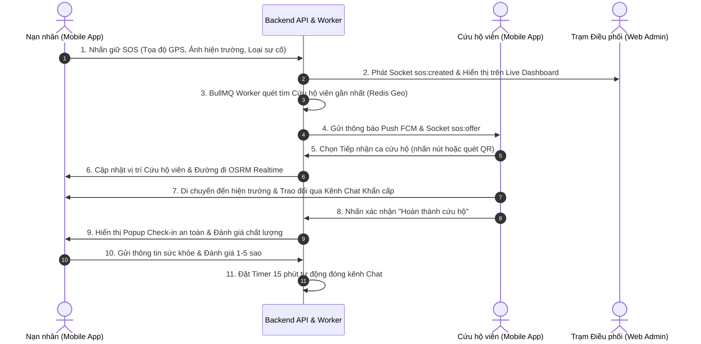

# BÁO CÁO REVIEW VÀ TỔNG KẾT DỰ ÁN TỐT NGHIỆP

> **Tên dự án:** Xây dựng hệ thống cứu hộ khẩn cấp thời gian thực  
> **Kiến trúc:** Monorepo gồm `server/` (Express.js), `web/` (React + Vite), `mobile/` (Flutter)  
> **Trạng thái:** 🔥 **Đã hoàn thiện 100% tất cả các nền tảng & sẵn sàng vận hành**  
> **Cập nhật:** 08/2026

---

## I. Tổng quan Sản phẩm Cứu hộ Khẩn cấp

Dự án đã phát triển và hoàn thiện thành công hệ thống sinh thái cứu hộ khẩn cấp toàn diện gồm 3 lớp nền tảng chính:

1. **Backend Server (`server/`)**: Xây dựng theo kiến trúc Layered Modular tiên tiến, tích hợp CSDL PostgreSQL, Redis Geo, BullMQ Message Queue, Socket.io thời gian thực và trí tuệ nhân tạo Groq Cloud AI.
2. **Mobile Application (`mobile/`)**: Ứng dụng Flutter dành riêng cho Nạn nhân (Victim) và Cứu hộ viên (Rescuer) với kiến trúc Feature-First Clean Architecture, tối ưu hóa giao diện cho các tình huống khẩn cấp ngoài hiện trường.
3. **Web Admin Dashboard (`web/`)**: Trang quản trị React/Vite tích hợp TailwindCSS theo tone màu xám đen hiện đại, cung cấp bộ công cụ điều phối, theo dõi Heatmap điểm nóng, kiểm duyệt AI và trích xuất báo cáo vận hành thời gian thực.

---

## II. Kết quả Triển khai Chi tiết theo Nền tảng

### 1. Backend Server (`server/`)

- **Xác thực & Tài khoản (Auth & Profile)**: Đăng ký, đăng nhập JWT/Refresh token, gửi mã xác thực email OTP, đăng nhập Google Sign-In, quản lý thông tin cá nhân và quản lý hồ sơ kỹ năng cứu hộ.
- **Tạo & Phát Yêu cầu Khẩn cấp (SOS & Multi-channel)**: Phát yêu cầu SOS khẩn cấp kèm ảnh hiện trường và loại sự cố, tự động đặt job hủy sau 30 phút inactive (`BullMQ`), hỗ trợ quy trình nhận ca qua mã QR (QR Fallback) khi mất kết nối mạng.
- **Thuật toán Ghép đôi & Định vị (Matching & Location)**: Tìm kiếm cứu hộ viên gần nhất qua Redis Geo theo nhiều vòng bán kính (`2km, 5km, 10km, 20km`), tự động phát socket cập nhật tọa độ GPS thời gian thực.
- **Điều phối & Trao đổi Khẩn cấp (Dispatch, Chat & FCM)**: Hệ thống gửi lời mời nhận ca đến cứu hộ viên, kênh nhắn tin realtime (tự động khóa sau 15 phút kết thúc/hủy ca), và gửi push notification qua Firebase Cloud Messaging (FCM).
- **Phát hiện Vùng Rủi ro Tự động (Crowd-Sourced Hazard Clustering)**: Thuật toán tự động quét mật độ dữ liệu SOS ($\ge 3$ ca trong bán kính 200m) để gợi ý các vùng nguy hiểm mới cho Admin duyệt.
- **Tiếp nhận Phản hồi Xác minh Điểm Nguy hiểm (Community Verification Feedback)**: Cơ chế thu thập và tổng hợp phản hồi đa chiều từ cộng đồng (Xác nhận thật, Báo giả mạo, Báo đã an toàn, Xác nhận nguy hiểm) kết hợp kiểm duyệt văn bản AI.
- **Quản lý Bản đồ Tiện ích Khẩn cấp (Emergency Amenities)**: Quản lý vị trí bệnh viện, trạm xăng, điểm sửa xe khẩn cấp, tiếp nhận báo cáo vi phạm và tính năng gộp điểm trùng lặp (`Duplicate Detection & Merge`).
- **Trích xuất Báo cáo Vận hành (Automated Reports Export)**: API dedicated xuất file CSV/Excel (UTF-8 BOM chuẩn font Việt) chứa toàn bộ nhật ký ca cứu hộ, mốc thời gian và vị trí GPS.
- **Hậu xử lý & Xác nhận An toàn (Post-Rescue Safety Check-in)**: Tiếp nhận thông tin xác nhận an toàn, trạng thái sức khỏe nạn nhân và điểm đánh giá chất lượng phục vụ 1-5 sao của Cứu hộ viên.
- **Kiểm duyệt AI Moderation & Từ điển Từ cấm Nhạy cảm**: Kiểm duyệt văn bản qua Groq Cloud API (Llama 3.3/70b) kết hợp từ điển local (`blacklisted_phrases`), cơ chế non-blocking giúp chặn từ vi phạm với chi phí 0-token.
- **Tóm tắt & Phân tích AI (AI Executive Summarization & Sentiment Analysis)**: Tự động phân tích chỉ số vận hành 7-30 ngày sinh báo cáo tóm tắt cho Admin và phân tích cảm xúc (Tích cực/Trung lập/Tiêu cực) cho mọi đánh giá chất lượng.
- **Quản lý Khóa tài khoản (Account Suspension & Ban Management)**: Middleware `isNotBanned` chặn API tức thì khi tài khoản vi phạm, tự động ép đăng xuất client khi nhận mã HTTP 403.

---

### 2. Mobile Application (`mobile/`)

- **Trải nghiệm SOS Khẩn cấp**: Nút nhấn giữ 2 giây chống chạm nhầm, gửi SOS kèm ảnh chụp hiện trường, đính kèm GPS chính xác.
- **Kênh Liên hệ Khẩn cấp Đa phương thức**: Gọi tổng đài quốc gia 24/7 (115, 114, 113, 112), gửi tin nhắn SMS đính kèm liên kết định vị Google Maps, và lưu/gọi số điện thoại khẩn cấp người thân.
- **Quy trình Nhận ca qua Mã QR (QR Fallback)**: Tạo & quét mã QR SOS trực tiếp qua máy ảnh hoặc thư viện ảnh khi thiết bị mất mạng.
- **Dẫn đường & ETA Thời gian thực**: Tích hợp đường đi OSRM chỉ đường nội bộ cho cứu hộ viên, tự động cập nhật thời gian dự kiến đến (ETA) và khoảng cách khi di chuyển GPS.
- **Geofencing & Cảnh báo Vùng Nguy hiểm**: Phát âm thanh/rung cảnh báo theo bán kính rủi ro (Cao 500m / Trung bình 350m / Thấp 200m) và hiển thị Modal xác minh hiện trường.
- **Bản đồ Tiện ích & Smart Search**: Tìm kiếm điểm tiện ích theo khoảng cách GPS, phân loại danh mục, tính năng chỉ đường OSRM nội bộ.
- **Quy trình Hậu xử lý & Đánh giá**: Popup `Post-Rescue Check-in Sheet` tự động hiển thị sau ca cứu hộ để chọn trạng thái sức khỏe và đánh giá cứu hộ viên theo nhiều chỉ số.
- **Cơ chế Khóa Chat & Tự Hủy SOS**: Tự động thông báo và khóa khung chat sau 15 phút kết thúc ca, hiển thị thông báo lý do khi ca SOS chờ quá 30 phút tự hủy.
- **Khả năng Chống chịu Mạng yếu (Offline Resiliency)**: Hàng đợi lưu tin nhắn/định vị offline, tự động khôi phục kết nối Socket và tự Refresh Token khi hết hạn.

---

### 3. Web Admin Dashboard (`web/`)

- **Live Dashboard Realtime**: Lắng nghe sự kiện diễn biến ca SOS thời gian thực qua Socket.io, hiển thị chỉ số tổng quan và thông báo Toast tức thì.
- **Bản đồ Heatmap Điểm nóng**: Hiển thị mật độ sự cố với trọng số nguy cấp (intensity động), tự động fit khung nhìn bản đồ.
- **Kênh Hỗ trợ Khẩn cấp Đa Admin (Multi-Admin Support Chat)**: Tổng đài chat trực tuyến nổi trên toàn trang cho phép đội ngũ Admin tiếp nhận hỗ trợ nạn nhân realtime.
- **Card AI Tóm tắt Điều hành**: Nút bấm 1-click kích hoạt AI Llama 3.3 tóm tắt tình hình vận hành và đưa ra khuyến nghị điều phối.
- **Quản lý Tiện ích & Điểm Nguy hiểm**: Kiểm duyệt thông tin, xem ảnh đính kèm, gỡ bỏ địa điểm vi phạm/lừa đảo, gộp địa điểm trùng lặp.
- **Trang Quản trị AI Moderation**: Theo dõi chi tiết danh sách tin nhắn/nội dung bị cắm cờ vi phạm tiêu chuẩn cộng đồng, xem cụm từ nhạy cảm bóc tách, thao tác Duyệt/Bác bỏ.
- **Phân tích Chất lượng & Cảm xúc AI**: Thống kê nhận xét nạn nhân, bộ lọc 1-5 sao, lọc cảm xúc AI (Tích cực/Trung lập/Tiêu cực) và biểu đồ xu hướng theo khung thời gian.
- **Trang Cấu hình Hệ thống Realtime (System Settings)**: 4 Tab cho phép Admin tùy chỉnh trực tiếp bán kính điều phối, bán kính cảnh báo Geofence, công tắc AI Moderation và số Hotline khẩn cấp mà không cần khởi động lại Server.

---

## III. Luồng Cứu hộ Khẩn cấp Cốt lõi

---

## IV. Đánh giá Tổng thể & Giá trị Kỹ thuật

- **Tính Đúng đắn & An toàn**: Đạt tiêu chuẩn tối cao cho ứng dụng khẩn cấp nhờ các cơ chế xác nhận 2 bước chống bấm nhầm, quy trình dự phòng QR Fallback khi mất mạng, và bộ từ điển từ cấm AI Moderation bảo vệ cộng đồng.
- **Hiệu năng & Khả năng Mở rộng**: Sử dụng kiến trúc bất đồng bộ (Async Non-blocking), Redis Geo đệm vị trí định vị và BullMQ Queue đảm bảo hệ thống phản hồi cực nhanh dưới áp lực hàng ngàn yêu cầu cùng lúc.
- **Tính Thực tiễn ngoài Hiện trường**: Ứng dụng Mobile Flutter phản hồi mượt mà, hỗ trợ OSRM chỉ đường chính xác, tự nâng bán kính Geofence và tích hợp sẵn nút gọi 115/114/113/112 nhanh.

---

## V. Định hướng Phát triển Tương lai (Roadmap)

1. **Tích hợp Kênh Dịch tự động Đa ngôn ngữ (Multi-language Translate API)**: Hỗ trợ tự động dịch tin nhắn giữa Nạn nhân quốc tế và Cứu hộ viên địa phương trong tình huống cứu hộ du khách.
2. **Hỗ trợ Thiết bị IoT & Nút bấm SOS Phần cứng (IoT Bluetooth SOS Beacon)**: Kết nối với các thiết bị đeo thông minh hoặc nút bấm Bluetooth ngoài hiện trường để tự động phát SOS khi xảy ra va chạm mạnh.
3. **Mở rộng Widget Cứu hộ trên Màn hình khóa Mobile (iOS Live Activities & Android Lockscreen Widget)**: Hiển thị trực tiếp khoảng cách cứu hộ viên và thời gian ETA ngay trên màn hình khóa điện thoại mà không cần mở ứng dụng.

---

## VI. Kết luận

Nói ngắn gọn: **Dự án tốt nghiệp "Xây dựng hệ thống cứu hộ khẩn cấp thời gian thực" đã hoàn thành 100% tất cả các mục tiêu đề ra, đạt chuẩn kiến trúc phần mềm hiện đại, vận hành ổn định mượt mà trên cả 3 nền tảng (Server, Mobile App, Web Admin) và sẵn sàng đưa vào ứng dụng thực tế để hỗ trợ cộng đồng.**
