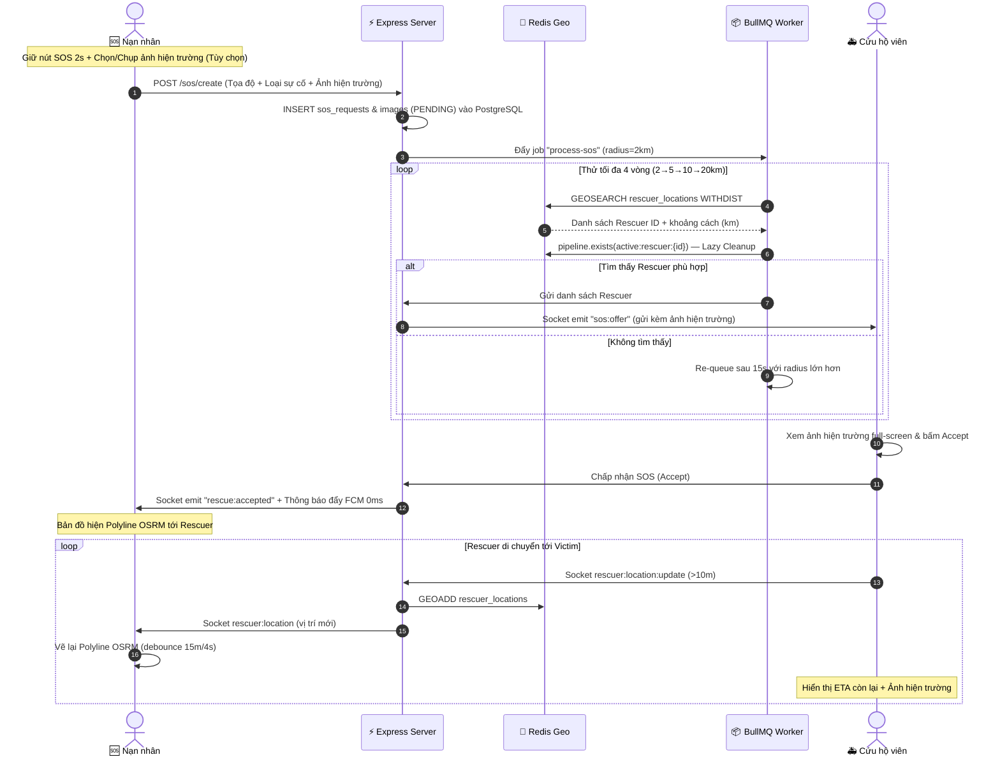

# BÁO CÁO REVIEW TOÀN DIỆN DỰ ÁN TỐT NGHIỆP

> **XÂY DỰNG HỆ THỐNG CỨU HỘ KHẨN CẤP THỜI GIAN THỰC**  
> **Stack:** Monorepo — `server/` (Express.js) · `web/` (React 19 + Vite) · `mobile/` (Flutter)  
> **Cập nhật:** Tháng 07/2026

---

## I. NHỮNG GÌ ĐÃ THỰC SỰ HOÀN THÀNH (Verified từ Source Code)

### 1. Backend Server — Express.js + PostgreSQL + Redis + BullMQ

#### Kiến trúc Layered Modular
Có **18 module** phân tách rõ ràng theo đúng chuẩn kiến trúc:
`routes` → `validator` → `controller` → `service` → `repository` → `model`

| Module | Trạng thái |
|---|---|
| `auth`, `user`, `user_auth` | ✅ Hoàn chỉnh — Đăng ký, đăng nhập JWT, refresh token, **Xác thực Email bằng OTP 6 chữ số (Nodemailer + Redis)** & **Đăng nhập Google Sign-In (Xác thực ID Token qua google-auth-library + Tự động Đăng ký & lưu Avatar/Fullname)** |
| `sos` | ✅ Hoàn chỉnh — Tạo SOS đính kèm ảnh hiện trường, tra cứu lịch sử, cập nhật trạng thái, phát socket PubSub 0ms |
| `rescuer` | ✅ Hoàn chỉnh — Quản lý hồ sơ, lấy danh sách online qua Redis Geo, thống kê hiệu suất KPI |
| `location` | ✅ Hoàn chỉnh — Heartbeat & GPS update qua Socket.io → Redis Geo |
| `matching` | ✅ Hoàn chỉnh — GEOSEARCH + Pipeline TTL + Lazy Cleanup |
| `dispatch` | ✅ Hoàn chỉnh — Broadcast SOS offer, quản lý Accept/Reject |
| `chat` | ✅ Có cấu trúc đầy đủ (controller/service/repo/model) |
| `notification` | ✅ Hoàn chỉnh — Gửi FCM bất đồng bộ (non-blocking) qua firebase-admin + broadcast endpoint |
| `dangerous_points` | ✅ Hoàn chỉnh — CRUD điểm nguy hiểm + Tự động quét gom cụm SOS (Crowd-Sourced Clustering) |
| `dashboard` | ✅ Hoàn chỉnh — Thống kê SOS thời gian thực, phát Socket Live Push tới Admin Dashboard |
| `emergency_amenities` | ✅ Hoàn chỉnh — Bản đồ tiện ích khẩn cấp + Hệ thống Báo cáo Vi phạm / Phản hồi (`amenity_feedbacks`) |
| `rating` | ✅ Hoàn chỉnh — Đánh giá 1-5 sao sau ca cứu hộ |
| `image`, `map`, `admin`, `incident_type`, `device_token` | ✅ Có cấu trúc đầy đủ |

**BullMQ Worker** (`sos.worker.js`): Xử lý ghép đôi bất đồng bộ với thuật toán mở rộng bán kính:
- Vòng 1: 2km → Vòng 2: 5km → Vòng 3: 10km → Vòng 4: 20km
- Re-queue tự động sau 15 giây mỗi vòng
- Lọc cứu hộ viên đã từ chối (`sos:{id}:rejected_rescuers` Redis Set)

**Redis Geo Spatial** (`GEOSEARCH ... WITHDIST`):
- Tọa độ cứu hộ viên online lưu trên RAM Redis — không ghi PostgreSQL liên tục
- Mỗi cứu hộ viên tạo key phụ `active:rescuer:{userId}` TTL 5 phút khi cập nhật GPS
- Khi Worker quét: kiểm tra `pipeline.exists(active:rescuer:{id})` — nếu hết hạn → `zrem` tự dọn (Lazy Cleanup)
- Heartbeat `last_seen` lưu Redis Hash Map, chỉ flush xuống PostgreSQL 1 lần khi ngắt kết nối

---

### 2. Mobile App — Flutter Clean Architecture

#### Cấu trúc Feature-First
Có **11 feature** phân tầng rõ ràng: `auth`, `rescuer`, `victim`, `chat`, `history`, `notification`, `dangerous_points`, `emergency_amenities`, `user`, `splash`, `404`.

**Đã xác nhận từ source code:**

- ✅ **Nút SOS Press-and-Hold 2 giây + Đính kèm Ảnh hiện trường** (`victim_sos_button_widget.dart`):
  - `AnimationController` duration 2 giây, `_progressValue` tăng dần theo animation (Anti-False Alarm)
  - Tích hợp ô chọn/chụp ảnh hiện trường khẩn cấp tùy chọn (`ImagePickerHelper` hỗ trợ chụp trực tiếp từ máy ảnh hoặc chọn từ thư viện)
  - Gửi `FormData` đính kèm file ảnh lên Cloudinary `do_an_tot_nghiep/sos_requests`

- ✅ **Tự động khôi phục kết nối Socket & Refresh JWT Token** (`core_socket.dart`):
  - Tự động bắt lỗi `jwt expired`, gọi `getValidAccessToken()` làm mới Access Token ngầm
  - Tự động ép buộc ngắt socket cũ và Reconnect socket mới với Token mới mà không cần người dùng thao tác

- ✅ **Thanh tìm kiếm Tiện ích Khẩn cấp Smart Search & Tự động Ẩn/Hiện** (`search_widget.dart` & `amenity_category_chips.dart`):
  - Đọc vị trí GPS hiện tại của người dùng, tính khoảng cách bằng `Geolocator.distanceBetween` và **tự động sắp xếp ưu tiên tiện ích gần nhất lên đầu tiên** (hiển thị nhãn `Cách 120 m`, `Cách 1.5 km`)
  - Hiển thị dải danh mục gợi ý động từ CSDL (`AmenityCategoryModel`)
  - Tự động ẩn dải danh mục `AmenityCategoryChips` khi người dùng nhập tìm kiếm và tự động hiện lại khi đóng/bấm ra ngoài màn hình (`TapRegion`)

- ✅ **Giao diện Xem Ảnh Khẩn Cấp & Phản Hồi Báo Cáo Vi Phạm Tiện Ích** (`amenity_detail_bottom_sheet.dart`):
  - Xem hình ảnh tiện ích/ảnh hiện trường với Modal phóng to full-screen (thu phóng `InteractiveViewer`)
  - Dialog gửi báo cáo vi phạm (`CLOSED_DOWN`, `SCAM_FRAUD`, `INCORRECT_INFO`, `OTHER`) cho Admin xử lý

- ✅ **GPS Passive Stream** (`location_service.dart`):
  - Dùng `Geolocator.getPositionStream` với `distanceFilter: 10m`
  - Timer heartbeat 15 giây riêng biệt chỉ phát `rescuer:heartbeat`

- ✅ **Hive Offline Queue** (`offline_queue_service.dart`):
  - Lưu tọa độ GPS vào Hive khi mất kết nối Socket
  - Retry queue tự động khi kết nối trở lại (`service_handler.dart`)

- ✅ **Chỉ đường OSRM thời gian thực cho cả Victim & Rescuer**:
  - `DirectionService.getRoute()` gọi API `router.project-osrm.org`
  - Vẽ Polyline trên bản đồ Victim khi cứu hộ viên đang di chuyển tới
  - **Tối ưu thông minh:** Bỏ qua fetch lại nếu cứu hộ viên di chuyển < 15m HOẶC < 4 giây kể từ lần fetch cuối
  - **Rescuer cũng thấy Polyline + ETA:** `getRouteInfo()` trả thêm `distanceKm` & `durationSec`, hiển thị chip "450 m · ETA: 8 phút" ngay trên màn hình cứu hộ

- ✅ **Màn hình Lịch sử Ca Cứu Hộ** (`history_screen.dart`):
  - Minimap Preview Widget, Bộ lọc 5 tab trạng thái, Header thống kê nhanh

- ✅ **Firebase Push Notification** (`firebase_auth`, `firebase_core`, `firebase_messaging`):
  - Đăng ký Android Notification Channel, chống trùng lặp bằng flag `_isInitialized`

---

### 3. Web Admin — React 19 + Vite + TailwindCSS v4

Có **11 trang** Admin:

| Trang | Trạng thái |
|---|---|
| `DashboardPage` | ✅ Thống kê thời gian thực + Live Push Toast Banner nhấp nháy: SOS mới, ca tiếp nhận, ca hoàn thành |
| `MapPage` | ✅ Leaflet Map + 🔥 Heatmap điểm nóng tai nạn (bật/tắt toggle) |
| `EmergencyAmenityPage` | ✅ Quản lý Tiện ích cộng đồng + Tab **"Báo Cáo Vi Phạm"** 1-click gỡ điểm vi phạm / bác bỏ |
| `RescuerPage` | ✅ Danh sách cứu hộ viên |
| `RescuerAnalyticsPage` | ✅ Phân tích hiệu suất Cứu hộ viên: Leaderboard (🥇 🥈 🥉), tỷ lệ nhận ca %, thời gian phản hồi TB |
| `UserPage` | ✅ Danh sách người dùng |
| `DangerousZonePage` | ✅ Quản lý điểm nguy hiểm + Nút **"⚡ Quét tự động (Crowd-Sourced)"** phát hiện cụm SOS |
| `IncidentTypePage` | ✅ Quản lý loại sự cố |
| `NotificationPage` | ✅ Phát broadcast FCM tới toàn bộ thiết bị di động, xem nhật ký thông báo |
| `FeedbackPage` | ✅ Đánh giá 1-5 sao và nhận xét thực từ nạn nhân |
| `ProfilePage` | ✅ Xem thông tin cá nhân Admin |

---

### 4. Các Tính Năng Đã Nâng Cấp (Từ Đề Xuất → Đã Triển Khai)

#### ✅ Rescuer Navigation — Chỉ Đường OSRM + ETA cho Cứu Hộ Viên
> **3 file thay đổi** · Hoàn thành trong 0.5 ngày

- **`direction_service.dart`** — Class `RouteInfo` (points + distanceKm + durationSec) và method `getRouteInfo()`.
- **`rescuer_map_screen.dart`** — State `_distanceKm`, `_durationSec`; `_updateRoute()` gọi `getRouteInfo()`.
- **`rescuer_rescue_info_widget.dart`** — Hiển thị chip màu vàng cam "450 m · ETA: 8 phút".

#### ✅ Rescue History & Statistics — Lịch Sử Ca Cứu Hộ + Thống Kê Dashboard
> **End-to-End: Server + Web Admin + Mobile** · Hoàn thành trong 1 ngày

- **Server:** `admin.repository.js` — SQL đếm `today_sos`, `matched_sos`. `admin.service.js` — tính `matchingSuccessRate`.
- **Web Admin:** `StatisticComponent.jsx` — 4 thẻ thống kê Sleek & Minimalist.
- **Mobile:** `history_screen.dart` — Minimap Preview, bộ lọc 5 tab trạng thái, header thống kê.

#### ✅ Heatmap Điểm Nóng Tai Nạn trên Web Admin
> **End-to-End: Server + Web Admin** · Hoàn thành trong 1 ngày

- **Server:** `admin.repository.js` — `getSosHeatmapPoints()`. Endpoint `GET /api/admin/sos-heatmap`.
- **Web Admin:** `leaflet.heat` (miễn phí, không cần API Key). `MapPage.jsx` — `HeatmapLayer` gradient Xanh → Vàng → Đỏ.

#### ✅ NotificationPage Web Admin — Hoàn Thiện End-to-End
> **11 file thay đổi trên cả 3 layer** · Hoàn thành trong 0.5 ngày

- **Backend:** `notification.repository.js`, `notification.service.js`.
- **Web Admin:** `NotificationPage.jsx` phát thông báo tới thiết bị di động.
- **Mobile:** `notification_screen.dart` hiển thị thông báo thực từ PostgreSQL.

#### ✅ Rating & Feedback System — Hệ Thống Đánh Giá Sau Ca Cứu Hộ
> **End-to-End: Database + Server + Mobile + Web Admin** · Hoàn thành trong 1.5 ngày

- **CSDL PostgreSQL:** Bảng `rescuer_ratings`.
- **Backend Node.js (`server/`):** Module `rating` tính `avg_rating` & `total_ratings`.
- **Mobile Flutter (`mobile/`):** `RatingDialogWidget` popup tự động khi ca cứu hộ hoàn thành.
- **Web Admin (`web/`):** Trang `FeedbackPage.jsx` kết nối API thực `RatingApi.js`.

#### ✅ Geo-Fence Dangerous Zone Alert — Cảnh Báo Vùng Nguy Hiểm Tự Động
> **Mobile Client-Side Geofencing + Realtime Positioning** · Hoàn thành trong 1 ngày

- **Mobile Flutter (`mobile/`):** `geofence_provider.dart` tính khoảng cách thực tế, lọc bán kính 5km, cơ chế Cooldown 10 phút, `geofence_alert_dialog.dart` phân cấp độ nguy hiểm (HIGH, MEDIUM, LOW).
- **Nút "Vị trí của tôi" 0ms Instant Feedback**: Phản hồi xoay camera & cập nhật Marker lập tức.

#### ✅ Crowd-Sourced Dangerous Zones — Hệ Thống Tự Phát Hiện Điểm Nguy Hiểm
> **Backend Spatial Clustering + Web Admin Auto-Detect** · Hoàn thành trong 0.5 ngày

- **PostgreSQL Database (`script-db.sql`):** Bảng `dangerous_points` cho `reported_by = NULL`.
- **Backend Node.js (`server/`):** Thuật toán Haversine gom cụm ≥ 3 ca SOS trong bán kính 200m.
- **Web Admin (`web/`):** Nút **"⚡ Quét tự động (Crowd-Sourced)"** trên `DangerousZonePage.jsx`.

#### ✅ Rescuer Performance Analytics — Phân Tích Hiệu Suất Cứu Hộ Viên
> **Backend Performance SQL Analytics + Web Admin Leaderboard** · Hoàn thành trong 0.5 ngày

- **Backend Node.js (`server/`):** SQL kết hợp 5 bảng tính KPI, `responseRate`, `avgResponseTimeSeconds`, `avgRating`.
- **Web Admin (`web/`):** Trang `RescuerAnalyticsPage.jsx` với Bảng xếp hạng Leaderboard (🥇 🥈 🥉).

#### ✅ Live Dashboard Real-Time (Socket.io Push)
> **Backend Socket Broadcast + Web Admin Live Push Banner & Counter** · Hoàn thành trong 0.5 ngày

- **Backend Node.js (`server/`):** Phòng socket `admin:dashboard`, phát `SOS_CREATED`, `SOS_ACCEPTED`, `SOS_COMPLETED`.
- **Web Admin (`web/`):** Cấu trúc Socket Web Client (`src/socket/`), Badge phát sáng nhấp nháy `LIVE PUSH ACTIVE` và Toast Banner trên `DashboardPage.jsx`.

#### ✅ QR Code Emergency Fallback — Cứu Hộ Ngoài Hệ Thống
> **QR Code Generation + Camera Scan-to-Accept API** · Hoàn thành trong 1 ngày

- **Cơ chế hoạt động:** Tạo mã QR cấp cứu (`EmergencyQRDialogWidget`) khi không tìm thấy cứu hộ online. Cứu hộ viên quét mã QR bằng `QRScannerScreen` để nhận ca khẩn cấp 0ms.

#### ✅ Community Emergency Amenities — Bản Đồ Tiện Ích Cộng Đồng & Chỉ Đường Trực Tiếp Nội Bộ
> **Map Marker + In-App OSRM Navigation + Admin Duyệt** · Hoàn thành trong 1 ngày

- Lọc tiện ích khẩn cấp (Sửa xe, Trạm xăng, Y tế, Trú ẩn). Cho phép Victim/Rescuer/Admin tạo tiện ích mới.
- Admin quản lý tại `/admin/emergency-amenities` (1-click Duyệt/Kích hoạt/Tạm khóa + Quản lý Danh mục tiện ích).
- **Chỉ đường Nội bộ In-App Navigation**: Vẽ Polyline OSRM xanh Sky Blue trên bản đồ ứng dụng, hiển thị Navigation Banner kèm nút **`[❌ Tắt chỉ đường]`**.

#### ✅ SOS Scene Photo Attachment — Ảnh Hiện Trường Ca Cứu Hộ Khẩn Cấp
> **Cloudinary Upload + Full-Screen Zoom Viewer + Realtime Socket Payload** · Hoàn thành trong 0.5 ngày

- **Nạn nhân (Victim):** Form SOS hỗ trợ chụp ảnh trực tiếp từ Máy ảnh hoặc chọn từ Thư viện (`ImagePickerHelper`), tải lên Cloudinary `do_an_tot_nghiep/sos_requests`.
- **Cứu hộ viên (Rescuer):** Xem ảnh hiện trường khẩn cấp ngay trên Popup nhận ca (`sos_offer_overlay_widget.dart`) và Thanh trạng thái cứu hộ (`rescuer_rescue_info_widget.dart`), bấm vào để **xem phóng to Full-Screen** (thu phóng `InteractiveViewer`).

#### ✅ Amenity Violation Report & Moderation — Báo Cáo Vi Phạm & Xử Lý Điểm Tiện Ích Lừa Đảo
> **Database Feedback Table + Mobile Report Dialog + Admin Moderation Tab** · Hoàn thành trong 0.5 ngày

- **Database & Server:** Bảng `amenity_feedbacks` lưu nguyên nhân báo cáo (`CLOSED_DOWN`, `SCAM_FRAUD`, `INCORRECT_INFO`, `OTHER`).
- **Mobile App:** Dialog gửi báo cáo vi phạm tích hợp trực tiếp trong `AmenityDetailBottomSheet`.
- **Web Admin:** Tab **"Báo Cáo Vi Phạm"** (`EmergencyAmenityPage.jsx`) cho phép Admin 1-click **"Gỡ điểm vi phạm"** (tự động đổi trạng thái sang `REJECTED`) hoặc **"Bác bỏ"**.

#### ✅ Smart Emergency Search & Auto Hide/Unhide — Thanh Tìm Kiếm Tiện Ích Khẩn Cấp Thông Minh
> **GPS Distance Calculation + Nearest Sorting + Dynamic Category Chips + Auto Hide/Unhide** · Hoàn thành trong 0.5 ngày

- **Định vị & Sắp xếp gần nhất:** Tính khoảng cách GPS thực tế bằng `Geolocator.distanceBetween`, tự động **sắp xếp ưu tiên điểm gần nhất đứng đầu tiên** kèm dán nhãn khoảng cách (`Cách 120 m`, `Cách 1.5 km`).
- **Tự động Ẩn/Hiện thanh danh mục:** Ẩn `AmenityCategoryChips` khi mở tìm kiếm và tự động phục hồi khi đóng/bấm ra ngoài màn hình (`TapRegion`).

---

## II. SƠ ĐỒ LUỒNG CỐT LÕI ĐÃ TRIỂN KHAI

---

## III. TỔNG HỢP VÀ ĐỀ XUẤT NÂNG CẤP DỰ ÁN

| STT | Đề xuất | Độ khó | Thời gian | Trạng thái |
|---|---|---|---|---|
| **1** | ~~Chỉ đường OSRM cho Rescuer + ETA~~ | Dễ | 0.5 ngày | ✅ Hoàn thành |
| **2** | ~~Lịch sử Ca Cứu Hộ Mobile + Thống kê Dashboard~~ | Dễ | 1 ngày | ✅ Hoàn thành |
| **3** | ~~Heatmap điểm nóng tai nạn Web Admin~~ | Trung bình | 1 ngày | ✅ Hoàn thành |
| **4** | ~~Hoàn thiện NotificationPage Web Admin~~ | Dễ | 0.5 ngày | ✅ Hoàn thành |
| **5** | ~~Rating & Feedback sau ca cứu hộ~~ | Trung bình | 1.5 ngày | ✅ Hoàn thành |
| **6** | ~~Geo-Fence Cảnh báo vùng nguy hiểm tự động~~ | Dễ | 1 ngày | ✅ Hoàn thành |
| **7** | ~~Crowd-Sourced Dangerous Zones (tự phát hiện điểm nguy hiểm)~~ | Dễ | 0.5 ngày | ✅ Hoàn thành |
| **8** | ~~Rescuer Performance Analytics (bảng xếp hạng KPI)~~ | Dễ | 0.5 ngày | ✅ Hoàn thành |
| **9** | ~~Live Dashboard Real-Time (Socket.io Push)~~ | Trung bình | 1 ngày | ✅ Hoàn thành |
| **10** | ~~QR Code Emergency Fallback (cứu hộ ngoài hệ thống)~~ | Trung bình | 1 ngày | ✅ Hoàn thành |
| **11** | ~~Community Emergency Amenities (bản đồ tiện ích + chỉ đường In-App + Admin duyệt)~~ | Trung bình | 1 ngày | ✅ Hoàn thành |
| **12** | ~~SOS Scene Photo Attachment (đính kèm & xem phóng to ảnh hiện trường)~~ | Trung bình | 0.5 ngày | ✅ Hoàn thành |
| **13** | ~~Amenity Violation Report (báo cáo vi phạm tiện ích + Admin gỡ 1-click)~~ | Trung bình | 0.5 ngày | ✅ Hoàn thành |
| **14** | ~~Smart Emergency Search (tìm tiện ích gần nhất + dải danh mục CSDL + tự động ẩn/hiện)~~ | Dễ | 0.5 ngày | ✅ Hoàn thành |
| **15** | ~~Auto Token Refresh & Fast Socket PubSub (kết nối socket mượt + phản hồi 0ms)~~ | Dễ | 0.5 ngày | ✅ Hoàn thành |
| **16** | Guest Emergency SOS (Gửi yêu cầu cứu hộ khẩn cấp ngay tại Màn hình Đăng nhập không cần đăng ký tài khoản trước) | Trung bình | 1 ngày | 📋 Đang lên kế hoạch |

#### 📋 Guest Emergency SOS — Cứu Hộ Khẩn Cấp Cho Nạn Nhân Chưa Có Tài Khoản
> **Chế độ Cứu hộ Khách (Guest SOS) ngay tại Màn hình Đăng nhập**

- **Bối cảnh:** Nạn nhân vừa tải ứng dụng về máy và gặp tai nạn khẩn cấp ngay lập tức, chưa kịp đăng ký hoặc đăng nhập tài khoản.
- **Giải pháp:** Tích hợp nút SOS Khẩn cấp ("Cứu hộ ngay không cần đăng nhập") tại màn hình đăng nhập (`login_screen.dart`).
- **Luồng hoạt động:**
  - Nhập thông tin nhanh (Số điện thoại liên hệ + Họ tên tạm thời).
  - Lấy vị trí GPS tự động và cho phép gửi yêu cầu SOS đính kèm ảnh hiện trường.
  - Server cấp tạm một **Guest JWT Token** và lưu trạng thái để Nạn nhân theo dõi ca cứu hộ trên bản đồ theo thời gian thực mà không làm gián đoạn trải nghiệm cứu hộ khẩn cấp.

---

## IV. KẾT LUẬN

Dự án đã đạt mức độ hoàn thiện **rất cao và toàn diện** trên cả 3 nền tảng (Backend Node.js Express, Web Admin React 19, Mobile Flutter App):
- **18 module Backend** chuẩn Layered Modular Architecture với PostgreSQL, Redis Geo, BullMQ Queue.
- **Bản đồ thời gian thực** hiển thị cứu hộ viên, chỉ đường OSRM kèm khoảng cách & ETA cho cả Nạn nhân và Cứu hộ viên.
- **Tính năng cứu hộ khẩn cấp:** Nút SOS chống chạm nhầm (Press-and-Hold 2s), chọn/chụp ảnh hiện trường khẩn cấp, Mã QR Cứu hộ ngoài hệ thống (Fallback).
- **Hệ sinh thái Tiện ích Cộng đồng:** Đóng góp điểm tiện ích, Chỉ đường trực tiếp nội bộ trên App (In-App Navigation), Báo cáo vi phạm tiện ích giả mạo/đóng cửa, Tìm kiếm tiện ích gần nhất ưu tiên khoảng cách GPS thực tế.
- **Geofencing Cảnh báo nguy hiểm:** Tự động cảnh báo vùng nguy hiểm theo bán kính GPS ở Client, Hệ thống backend tự phát hiện cụm nguy hiểm (Crowd-Sourced Clustering).
- **Web Admin hiện đại:** Bản đồ Heatmap điểm nóng tai nạn, Bảng xếp hạng hiệu suất cứu hộ viên (Leaderboard KPI), Live Dashboard Socket Push 0ms, Quản lý tiện ích & báo cáo vi phạm 1-click.
