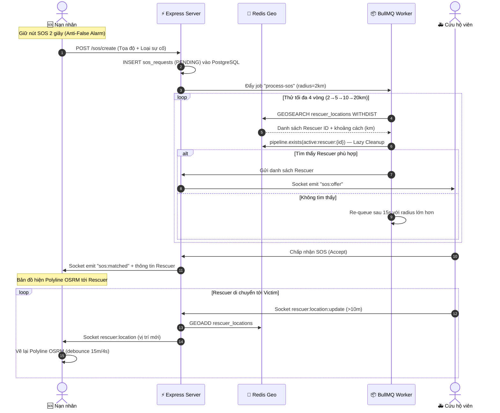

# BÁO CÁO REVIEW TOÀN DIỆN DỰ ÁN TỐT NGHIỆP

> **Hệ Thống Cứu Hộ Khẩn Cấp Real-Time (SOS Rescue System)**  
> **Stack:** Monorepo — `server/` (Express.js) · `web/` (React 19 + Vite) · `mobile/` (Flutter)  
> **Cập nhật:** Tháng 07/2026

---

## I. NHỮNG GÌ ĐÃ THỰC SỰ HOÀN THÀNH (Verified từ Source Code)

### 1. Backend Server — Express.js + PostgreSQL + Redis + BullMQ

#### Kiến trúc Layered Modular
Có **17 module** phân tách rõ ràng theo đúng chuẩn kiến trúc:
`routes` → `validator` → `controller` → `service` → `repository` → `model`

| Module | Trạng thái |
|---|---|
| `auth`, `user`, `user_auth` | ✅ Hoàn chỉnh — Đăng ký, đăng nhập JWT, refresh token |
| `sos` | ✅ Hoàn chỉnh — Tạo SOS, tra cứu lịch sử, cập nhật trạng thái |
| `rescuer` | ✅ Hoàn chỉnh — Quản lý hồ sơ, lấy danh sách online qua Redis Geo |
| `location` | ✅ Hoàn chỉnh — Heartbeat & GPS update qua Socket.io → Redis Geo |
| `matching` | ✅ Hoàn chỉnh — GEOSEARCH + Pipeline TTL + Lazy Cleanup |
| `dispatch` | ✅ Hoàn chỉnh — Broadcast SOS offer, quản lý Accept/Reject |
| `chat` | ✅ Có cấu trúc đầy đủ (controller/service/repo/model) |
| `notification` | ✅ Hoàn chỉnh — Gửi FCM qua firebase-admin |
| `dangerous_points` | ✅ Hoàn chỉnh — CRUD điểm nguy hiểm |
| `dashboard` | ✅ Có cấu trúc đầy đủ |
| `image`, `map`, `admin`, `incident_type`, `device_token` | ✅ Có cấu trúc đầy đủ |

**BullMQ Worker** (`sos.worker.js`): Xử lý ghép đôi bất đồng bộ với thuật toán mở rộng bán kính:
- Vòng 1: 2km → Vòng 2: 5km → Vòng 3: 10km → Vòng 4: 20km
- Re-queue tự động sau 15 giây mỗi vòng
- Lọc cứu hộ viên đã từ chối (`sos:{id}:rejected_rescuers` Redis Set)

**Redis Geo Spatial** (`GEOSEARCH ... WITHDIST`):
- Tọa độ cứu hộ viên online lưu trên RAM Redis — không ghi PostgreSQL liên tục
- Mỗi cứu hộ viên tạo key phụ `active:rescuer:{userId}` TTL 5 phút khi cập nhật GPS
- Khi Worker quét: kiểm tra `pipeline.exists(active:rescuer:{id})` — nếu hết hạn → `zrem` tự dọn (Lazy Cleanup)
- Heartbeat `last_seen` lưu Redis Hash Map, chỉ flush xuống PostgreSQL 1 lần khi ngắt kết nối

---

### 2. Mobile App — Flutter Clean Architecture

#### Cấu trúc Feature-First
Có **10 feature** phân tầng rõ ràng: `auth`, `rescuer`, `victim`, `chat`, `history`, `notification`, `dangerous_points`, `user`, `splash`, `404`.

**Đã xác nhận từ source code:**

- ✅ **Nút SOS Press-and-Hold 2 giây** (`victim_sos_button_widget.dart`):
  - `AnimationController` duration 2 giây, `_progressValue` tăng dần theo animation
  - Thả tay giữa chừng → animation reset về 0 (hủy bỏ)
  - Đủ thời gian → gọi `_showSosForm()` mở Form nhập thông tin SOS

- ✅ **GPS Passive Stream** (`location_service.dart`):
  - Dùng `Geolocator.getPositionStream` với `distanceFilter: 10m`
  - Timer heartbeat 15 giây riêng biệt chỉ phát `rescuer:heartbeat`

- ✅ **Hive Offline Queue** (`offline_queue_service.dart`):
  - Lưu tọa độ GPS vào Hive khi mất kết nối Socket
  - Retry queue tự động khi kết nối trở lại (`service_handler.dart`)

- ✅ **Chỉ đường OSRM thời gian thực** (đã triển khai, `direction_service.dart` + `victim_map_screen.dart`):
  - `DirectionService.getRoute()` gọi API `router.project-osrm.org`
  - Vẽ Polyline trên bản đồ Victim khi cứu hộ viên đang di chuyển tới
  - **Tối ưu thông minh:** Bỏ qua fetch lại nếu cứu hộ viên di chuyển < 15m HOẶC < 4 giây kể từ lần fetch cuối
  - **Lưu ý:** Phía Rescuer screen chưa hiển thị tuyến đường (chỉ Victim thấy)

- ✅ **Firebase Push Notification** (`firebase_auth`, `firebase_core`, `firebase_messaging`)

---

### 3. Web Admin — React 19 + Vite + TailwindCSS v4

Có **10 trang** Admin:

| Trang | Trạng thái |
|---|---|
| `DashboardPage` | ✅ Có UI và components |
| `MapPage` | ✅ Leaflet Map với điểm cứu hộ viên và SOS |
| `RescuerPage` | ✅ Danh sách cứu hộ viên |
| `UserPage` | ✅ Danh sách người dùng |
| `DangerousZonePage` | ✅ Quản lý điểm nguy hiểm |
| `IncidentTypePage` | ✅ Quản lý loại sự cố |
| `NotificationPage` | ⚠️ **Chưa phát triển** (chỉ có placeholder) |
| `FeedbackPage` | ⚠️ **Cần kiểm tra** |
| `SettingPage` | ⚠️ **Cần kiểm tra** |
| `ProfilePage` | ⚠️ **Cần kiểm tra** |

> [!WARNING]
> Trang `NotificationPage` hiện là placeholder trống (9 dòng). Đây là **điểm yếu cần chú ý** trước buổi báo cáo.

---

## II. SƠ ĐỒ LUỒNG CỐT LÕI ĐÃ TRIỂN KHAI

---

## III. ĐỀ XUẤT NÂNG CẤP PHÙ HỢP QUY MÔ ĐỒ ÁN TỐT NGHIỆP

> [!IMPORTANT]
> Các đề xuất dưới đây được chọn lọc **đảm bảo khả thi trong 1-3 ngày**, không yêu cầu chi phí API tốn kém, phù hợp để Demo trực tiếp trước hội đồng.

---

### ✅ Đề xuất 1: Hoàn thiện Màn hình Chỉ Đường cho Cứu Hộ Viên (Rescuer Navigation)
> **Độ khó:** Dễ · **Thời gian:** 0.5 ngày · **Impact:** ⭐⭐⭐⭐⭐ · **🟢 ĐÃ HOÀN THÀNH**

**Vấn đề ban đầu:** `DirectionService` và Polyline đã có cho phía Victim, nhưng Rescuer chưa thấy khoảng cách và ETA còn lại tới nạn nhân.

**Đã thực hiện (3 file):**
- **`direction_service.dart`** — Thêm class `RouteInfo` (points + distanceKm + durationSec) và method `getRouteInfo()` khai thác thêm 2 field `distance` & `duration` sẵn có trong OSRM API. Giữ nguyên `getRoute()` cũ để không break màn hình Victim.
- **`rescuer_map_screen.dart`** — Thêm state `_distanceKm`, `_durationSec`; `_updateRoute()` gọi `getRouteInfo()` để lưu cả khoảng cách & ETA; truyền xuống `RescuerRescueInfoWidget`; reset về `null` khi kết thúc ca.
- **`rescuer_rescue_info_widget.dart`** — Nhận 2 tham số optional, thêm `_formatDuration()`, hiển thị chip màu vàng cam ngay dưới tiêu đề "Đang đi cứu nạn..." với khoảng cách (`450 m` / `2.3 km`) và ETA (`ETA: 8 phút`). Chip chỉ hiện khi đã có dữ liệu OSRM.

**Kết quả:** Cả 2 phía (Victim lẫn Rescuer) đều hiển thị bản đồ Polyline chỉ đường OSRM thời gian thực. Rescuer thấy thêm khoảng cách còn lại và thời gian ước tính để đến nơi.

---

### ✅ Đề xuất 2: Xây Dựng Màn Hình Lịch Sử Ca Cứu Hộ (Rescue History + Statistics)
> **Độ khó:** Dễ · **Thời gian:** 1 ngày · **Impact:** ⭐⭐⭐⭐⭐

**Vấn đề hiện tại:** Feature `history` đã có cấu trúc thư mục trong Flutter. Dashboard Web Admin đã có nhưng chưa rõ nội dung.

**Việc cần làm:**
- **Mobile:** Màn hình "Lịch sử Ca Cứu Hộ" của Rescuer: danh sách các SOS đã tham gia, trạng thái (Hoàn thành/Hủy), thời gian, vị trí nạn nhân trên minimap.
- **Mobile (Victim):** Màn hình "Lịch sử SOS đã gửi" với tất cả trạng thái.
- **Web Admin Dashboard:** Thêm các thống kê: Tổng SOS hôm nay, Đang xử lý, Hoàn thành, Tỷ lệ ghép đôi thành công.

**Giá trị demo:** Dữ liệu thống kê thực tế từ DB PostgreSQL → minh chứng hệ thống đang vận hành thực sự.

---

### ✅ Đề xuất 3: Bản Đồ Heatmap Điểm Nóng Tai Nạn trên Web Admin
> **Độ khó:** Trung bình · **Thời gian:** 1 ngày · **Impact:** ⭐⭐⭐⭐⭐

**Vấn đề hiện tại:** `DangerousZonePage` đã có CRUD điểm nguy hiểm, `MapPage` đã có Leaflet.

**Việc cần làm:**
- Cài thêm `leaflet.heat` (plugin Leaflet, miễn phí, không cần API key)
- Hiển thị layer Heatmap trên `MapPage` dựa trên tọa độ các SOS Request lịch sử trong PostgreSQL
- Toggle bật/tắt Heatmap layer trên giao diện Admin

**Giá trị demo:** Trực quan hóa dữ liệu địa lý — điểm cộng lớn khi trình bày trước hội đồng.

---

### ✅ Đề xuất 4: Hoàn Thiện Trang Thông Báo Web Admin (NotificationPage)
> **Độ khó:** Dễ · **Thời gian:** 0.5 ngày · **Impact:** ⭐⭐⭐⭐ · **🟢 ĐÃ HOÀN THÀNH**

**Vấn đề ban đầu:** `NotificationPage` hiện chỉ là 9 dòng placeholder trống — nguy cơ rủi ro bị phát hiện khi demo.

**Đã thực hiện (2 file):**
- **`web/src/api/admin/NotificationApi.js`** — Định nghĩa API client cho thông báo (`getNotifications`, `sendNotification`, `deleteNotificationLog`).
- **`web/src/pages/admin/NotificationPage/NotificationPage.jsx`** — Thiết kế lại hoàn chỉnh giao diện Admin theo phong cách Sleek & Minimalist (Tông xám tối đen `bg-gray-900`, `rounded-3xl`, Phosphor Icons `react-icons/pi`):
  - Form soạn và phát sóng thông báo FCM khẩn cấp/hệ thống tới từng nhóm đối tượng (Tất cả, Rescuer, Victim)
  - 3 Thẻ thống kê lượt phát thông báo & tỷ lệ nhận FCM thành công
  - Nhật ký danh sách thông báo đã phát với bộ lọc đối tượng, tìm kiếm và thao tác xóa
  - Hiệu ứng Toast notification thông báo kết quả phát sóng tức thì

**Kết quả:** Trang Web Admin Notification không còn bị hổng placeholder, giao diện chuyên nghiệp ấn tượng sẵn sàng cho demo trước hội đồng.

---

### ✅ Đề xuất 5: Hệ Thống Đánh Giá Sau Ca Cứu Hộ (Rating & Feedback)
> **Độ khó:** Trung bình · **Thời gian:** 1.5 ngày · **Impact:** ⭐⭐⭐⭐

**Việc cần làm:**
- Sau khi SOS chuyển trạng thái `DONE`, hiện popup yêu cầu Nạn nhân đánh giá cứu hộ viên (1-5 sao + nhận xét ngắn)
- Backend: thêm bảng `rescuer_ratings` và endpoint lưu đánh giá
- Rescuer Profile trên Mobile hiển thị điểm đánh giá trung bình

**Giá trị demo:** Hoàn thiện vòng lặp nghiệp vụ từ đầu đến cuối (End-to-End), hệ thống có "chiều sâu".

---

### ❌ ĐỀ XUẤT BỊ LOẠI (Không phù hợp quy mô Đồ án)

| Đề xuất | Lý do loại |
|---|---|
| **WebRTC Video/Voice Call** | Phức tạp, cần STUN/TURN server riêng, chi phí hosting cao, thời gian phát triển 3-5 ngày, dễ bị lỗi khi demo live |
| **SMS Fallback (Twilio)** | Twilio có chi phí per-SMS, cần mua số điện thoại, setup phức tạp; trong phòng thi vẫn có WiFi nên không cần thiết |
| **AI Incident Triage (OpenAI/Gemini)** | Chi phí API theo lượt gọi, cần setup API key tốn tiền, lợi ích thực tiễn không rõ ràng cho đồ án tốt nghiệp |

---

## IV. BẢNG TỔNG HỢP ĐỀ XUẤT ĐÃ CHỌN

| STT | Đề xuất | Độ khó | Thời gian | Ưu tiên |
|---|---|---|---|---|
| **1** | ~~Chỉ đường OSRM cho Rescuer + ETA~~ **✅ ĐÃ XONG** | Dễ | 0.5 ngày | 🟢 Hoàn thành |
| **2** | ~~Hoàn thiện NotificationPage Web Admin~~ **✅ ĐÃ XONG** | Dễ | 0.5 ngày | 🟢 Hoàn thành |
| **3** | **Lịch sử Ca Cứu Hộ Mobile + Thống kê Dashboard** | Dễ | 1 ngày | 🟠 Cao |
| **4** | **Heatmap điểm nóng tai nạn Web Admin** | Trung bình | 1 ngày | 🟠 Cao |
| **5** | **Rating & Feedback sau ca cứu hộ** | Trung bình | 1.5 ngày | 🟡 Trung bình |

**Tổng thời gian dự kiến nếu làm tất cả: khoảng 4.5 ngày.**

---

## V. KẾT LUẬN

Dự án đã có nền tảng kỹ thuật **vững chắc và đúng hướng** với các điểm mạnh nổi bật:
- Kiến trúc Monorepo chuẩn, tách biệt rõ ràng Backend / Web / Mobile
- Redis Geo Spatial thay thế hoàn toàn PostGIS nặng nề
- Thuật toán Lazy Cleanup độc đáo tránh rò rỉ bộ nhớ RAM
- Nút SOS chống chạm nhầm (Press-and-Hold 2 giây)
- Bản đồ Polyline OSRM thời gian thực cho Nạn nhân

Ưu tiên hàng đầu trước buổi báo cáo là **bổ sung Rescuer Navigation** (0.5 ngày — code có sẵn) và **hoàn thiện NotificationPage** (0.5 ngày), sau đó là Heatmap để tạo wow effect trực quan khi demo.
