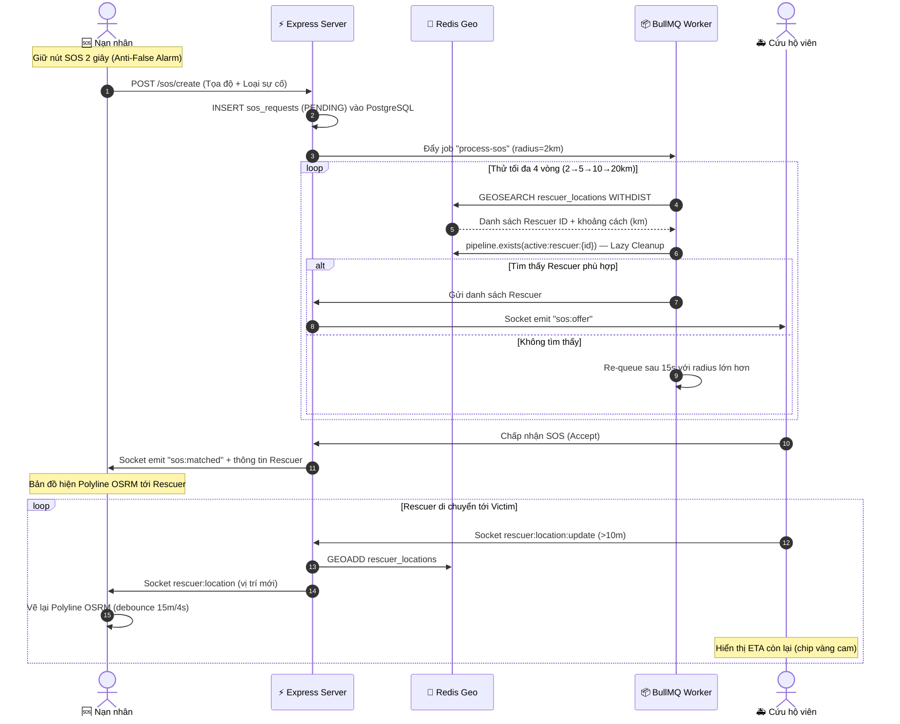

# BÁO CÁO REVIEW TOÀN DIỆN DỰ ÁN TỐT NGHIỆP

> **XÂY DỰNG HỆ THỐNG CỨU HỘ KHẨN CẤP THỜI GIAN THỰC**  
> **Stack:** Monorepo — `server/` (Express.js) · `web/` (React 19 + Vite) · `mobile/` (Flutter)  
> **Cập nhật:** Tháng 07/2026

---

## I. NHỮNG GÌ ĐÃ THỰC SỰ HOÀN THÀNH (Verified từ Source Code)

### 1. Backend Server — Express.js + PostgreSQL + Redis + BullMQ

#### Kiến trúc Layered Modular
Có **17 module** phân tách rõ ràng theo đúng chuẩn kiến trúc:
`routes` → `validator` → `controller` → `service` → `repository` → `model`

| Module | Trạng thái |
|---|---|
| `auth`, `user`, `user_auth` | ✅ Hoàn chỉnh — Đăng ký, đăng nhập JWT, refresh token |
| `sos` | ✅ Hoàn chỉnh — Tạo SOS, tra cứu lịch sử, cập nhật trạng thái |
| `rescuer` | ✅ Hoàn chỉnh — Quản lý hồ sơ, lấy danh sách online qua Redis Geo |
| `location` | ✅ Hoàn chỉnh — Heartbeat & GPS update qua Socket.io → Redis Geo |
| `matching` | ✅ Hoàn chỉnh — GEOSEARCH + Pipeline TTL + Lazy Cleanup |
| `dispatch` | ✅ Hoàn chỉnh — Broadcast SOS offer, quản lý Accept/Reject |
| `chat` | ✅ Có cấu trúc đầy đủ (controller/service/repo/model) |
| `notification` | ✅ Hoàn chỉnh — Gửi FCM qua firebase-admin + broadcast endpoint |
| `dangerous_points` | ✅ Hoàn chỉnh — CRUD điểm nguy hiểm |
| `dashboard` | ✅ Hoàn chỉnh — Thống kê SOS hôm nay, tỷ lệ ghép đôi thành công |
| `image`, `map`, `admin`, `incident_type`, `device_token` | ✅ Có cấu trúc đầy đủ |

**BullMQ Worker** (`sos.worker.js`): Xử lý ghép đôi bất đồng bộ với thuật toán mở rộng bán kính:
- Vòng 1: 2km → Vòng 2: 5km → Vòng 3: 10km → Vòng 4: 20km
- Re-queue tự động sau 15 giây mỗi vòng
- Lọc cứu hộ viên đã từ chối (`sos:{id}:rejected_rescuers` Redis Set)

**Redis Geo Spatial** (`GEOSEARCH ... WITHDIST`):
- Tọa độ cứu hộ viên online lưu trên RAM Redis — không ghi PostgreSQL liên tục
- Mỗi cứu hộ viên tạo key phụ `active:rescuer:{userId}` TTL 5 phút khi cập nhật GPS
- Khi Worker quét: kiểm tra `pipeline.exists(active:rescuer:{id})` — nếu hết hạn → `zrem` tự dọn (Lazy Cleanup)
- Heartbeat `last_seen` lưu Redis Hash Map, chỉ flush xuống PostgreSQL 1 lần khi ngắt kết nối

---

### 2. Mobile App — Flutter Clean Architecture

#### Cấu trúc Feature-First
Có **10 feature** phân tầng rõ ràng: `auth`, `rescuer`, `victim`, `chat`, `history`, `notification`, `dangerous_points`, `user`, `splash`, `404`.

**Đã xác nhận từ source code:**

- ✅ **Nút SOS Press-and-Hold 2 giây** (`victim_sos_button_widget.dart`):
  - `AnimationController` duration 2 giây, `_progressValue` tăng dần theo animation
  - Thả tay giữa chừng → animation reset về 0 (hủy bỏ)
  - Đủ thời gian → gọi `_showSosForm()` mở Form nhập thông tin SOS

- ✅ **GPS Passive Stream** (`location_service.dart`):
  - Dùng `Geolocator.getPositionStream` với `distanceFilter: 10m`
  - Timer heartbeat 15 giây riêng biệt chỉ phát `rescuer:heartbeat`

- ✅ **Hive Offline Queue** (`offline_queue_service.dart`):
  - Lưu tọa độ GPS vào Hive khi mất kết nối Socket
  - Retry queue tự động khi kết nối trở lại (`service_handler.dart`)

- ✅ **Chỉ đường OSRM thời gian thực cho cả Victim & Rescuer**:
  - `DirectionService.getRoute()` gọi API `router.project-osrm.org`
  - Vẽ Polyline trên bản đồ Victim khi cứu hộ viên đang di chuyển tới
  - **Tối ưu thông minh:** Bỏ qua fetch lại nếu cứu hộ viên di chuyển < 15m HOẶC < 4 giây kể từ lần fetch cuối
  - **Rescuer cũng thấy Polyline + ETA:** `getRouteInfo()` trả thêm `distanceKm` & `durationSec`, hiển thị chip "450 m · ETA: 8 phút" ngay trên màn hình cứu hộ

- ✅ **Màn hình Lịch sử Ca Cứu Hộ** (`history_screen.dart`) — nâng cấp toàn diện:
  - **Minimap Preview Widget:** Tích hợp `FlutterMap` xem trực tiếp vị trí nạn nhân kèm Marker đỏ trong từng thẻ lịch sử
  - **Bộ lọc trạng thái:** Tab "Tất cả", "Thành công", "Đang xử lý", "Thất bại / Hủy", "Từ chối / Hết giờ"
  - **Header thống kê nhanh:** Tổng ca, thành công, đang xử lý, hủy/lỗi

- ✅ **Firebase Push Notification** (`firebase_auth`, `firebase_core`, `firebase_messaging`):
  - Đăng ký Android Notification Channel, chống trùng lặp bằng flag `_isInitialized`
  - Màn hình thông báo hiển thị danh sách thực từ PostgreSQL, Pull-to-refresh, đánh dấu đã đọc

---

### 3. Web Admin — React 19 + Vite + TailwindCSS v4

Có **10 trang** Admin:

| Trang | Trạng thái |
|---|---|
| `DashboardPage` | ✅ Thống kê thời gian thực: SOS hôm nay, ca đang xử lý, ca hoàn thành, tỷ lệ ghép đôi |
| `MapPage` | ✅ Leaflet Map + 🔥 Heatmap điểm nóng tai nạn (bật/tắt toggle) |
| `RescuerPage` | ✅ Danh sách cứu hộ viên |
| `UserPage` | ✅ Danh sách người dùng |
| `DangerousZonePage` | ✅ Quản lý điểm nguy hiểm |
| `IncidentTypePage` | ✅ Quản lý loại sự cố |
| `NotificationPage` | ✅ Giao diện Sleek & Minimalist — phát broadcast FCM tới toàn bộ thiết bị, xem nhật ký thông báo từ DB |
| `FeedbackPage` | ⚠️ Cần kiểm tra |
| `SettingPage` | ⚠️ Cần kiểm tra |
| `ProfilePage` | ⚠️ Cần kiểm tra |

---

### 4. Các Tính Năng Đã Nâng Cấp (Từ Đề Xuất → Đã Triển Khai)

#### ✅ Rescuer Navigation — Chỉ Đường OSRM + ETA cho Cứu Hộ Viên
> **3 file thay đổi** · Hoàn thành trong 0.5 ngày

- **`direction_service.dart`** — Thêm class `RouteInfo` (points + distanceKm + durationSec) và method `getRouteInfo()` khai thác 2 field `distance` & `duration` sẵn có trong OSRM API. Giữ nguyên `getRoute()` cũ để không break màn hình Victim.
- **`rescuer_map_screen.dart`** — Thêm state `_distanceKm`, `_durationSec`; `_updateRoute()` gọi `getRouteInfo()` để lưu khoảng cách & ETA; reset về `null` khi kết thúc ca.
- **`rescuer_rescue_info_widget.dart`** — Hiển thị chip màu vàng cam "450 m · ETA: 8 phút" ngay dưới tiêu đề "Đang đi cứu nạn...". Chip chỉ hiện khi đã có dữ liệu OSRM.

#### ✅ Rescue History & Statistics — Lịch Sử Ca Cứu Hộ + Thống Kê Dashboard
> **End-to-End: Server + Web Admin + Mobile** · Hoàn thành trong 1 ngày

- **Server:** `admin.repository.js` — SQL đếm `today_sos`, `matched_sos`. `admin.service.js` — tính `matchingSuccessRate`, `activeSos`, `completedSos` trả về `/api/admin/dashboard/overview`.
- **Web Admin:** `StatisticComponent.jsx` — 4 thẻ thống kê Sleek & Minimalist: Tổng SOS hôm nay, Ca đang xử lý, Ca hoàn thành, Tỷ lệ ghép đôi thành công.
- **Mobile:** `history_screen.dart` — Minimap Preview, bộ lọc 5 tab trạng thái, header thống kê nhanh.

#### ✅ Heatmap Điểm Nóng Tai Nạn trên Web Admin
> **End-to-End: Server + Web Admin** · Hoàn thành trong 1 ngày

- **Server:** `admin.repository.js` — `getSosHeatmapPoints()` truy vấn tọa độ thực (`lat`, `lng`, `incident_type`, `status`) từ toàn bộ ca SOS. Endpoint bảo mật `GET /api/admin/sos-heatmap` (verifyToken + isAdmin).
- **Web Admin:** `leaflet.heat` (miễn phí, không cần API Key). `MapPage.jsx` — `HeatmapLayer` gradient Xanh → Vàng → Đỏ, tích hợp `LayersControl.Overlay` "🔥 Điểm nóng tai nạn" cho phép bật/tắt trực quan.

#### ✅ NotificationPage Web Admin — Hoàn Thiện End-to-End
> **11 file thay đổi trên cả 3 layer** · Hoàn thành trong 0.5 ngày

- **Backend:** `notification.repository.js` — lọc user theo vai trò, ghi thông báo vào PostgreSQL. `notification.service.js` — `broadcastNotification` ghi DB + phát FCM. Endpoints: `POST /api/notifications/broadcast`, `GET /api/notifications`, `PUT /api/notifications/read-all`.
- **Web Admin:** `NotificationPage.jsx` — giao diện Sleek & Minimalist (`bg-gray-900`, `rounded-3xl`, Phosphor Icons), load nhật ký thực từ DB, phát thông báo tới thiết bị di động.
- **Mobile:** `notification_screen.dart` — danh sách thông báo thực từ PostgreSQL, Pull-to-refresh, đánh dấu đã đọc. Fix lỗi `flutter_local_notifications ^22.0.1` named parameters API.

#### ✅ Rating & Feedback System — Hệ Thống Đánh Giá Sau Ca Cứu Hộ
> **End-to-End: Database + Server + Mobile + Web Admin** · Hoàn thành trong 1.5 ngày

- **CSDL PostgreSQL:** Bảng `rescuer_ratings` (`rating_id`, `sos_request_id` UNIQUE, `victim_id`, `rescuer_id`, `rating` 1-5 sao, `comment`, `created_at`).
- **Backend Node.js (`server/`):** Module `rating` (`rating.repository.js`, `rating.service.js`, `rating.controller.js`, `rating.route.js`) hỗ trợ gửi đánh giá, tính `avg_rating` & `total_ratings` của cứu hộ viên, ràng buộc chỉ Nạn nhân của ca SOS `DONE` mới được đánh giá 1 lần duy nhất.
- **Mobile Flutter (`mobile/`):** `RatingDialogWidget` popup tự động khi ca cứu hộ hoàn thành, tích hợp nút "Đánh giá ca cứu hộ này" trong màn hình Lịch sử (`history_screen.dart`).
- **Web Admin (`web/`):** Trang `FeedbackPage.jsx` kết nối API thực `RatingApi.js` hiển thị danh sách đánh giá 1-5 sao, tên nạn nhân, tên cứu hộ viên và nhận xét chi tiết.

#### ✅ Geo-Fence Dangerous Zone Alert — Cảnh Báo Vùng Nguy Hiểm Tự Động
> **Mobile Client-Side Geofencing + Realtime Positioning** · Hoàn thành trong 1 ngày

- **Mobile Flutter (`mobile/`):**
  - **`geofence_provider.dart`**: Tải danh sách điểm nguy hiểm đã duyệt từ Backend (`GET /api/dangerous_points/approved`), tự động tính khoảng cách thực tế từ vị trí GPS Nạn nhân bằng `Geolocator.distanceBetween` hoàn toàn ở phía client.
  - **Lọc bán kính 5km (`getNearbyPoints`)**: Tự động lọc & sắp xếp các điểm nguy hiểm trong phạm vi 5km xung quanh Nạn nhân để render trên bản đồ, tránh quá tải RAM và giúp ứng dụng hoạt động cực kỳ mượt mà.
  - **Khởi động quét tức thì**: Tự động lấy tọa độ ban đầu và bật Popup cảnh báo ngay khi mở ứng dụng nếu Nạn nhân đang ở trong vùng nguy hiểm (< 500m), không bị trễ hay cần chuyển màn hình.
  - **Cơ chế Cooldown 10 phút**: Quản lý Map `_alertCooldowns` ngăn ngừa lặp lại popup cảnh báo phiền phức khi Nạn nhân di chuyển trong bán kính 500m.
  - **`geofence_alert_dialog.dart` & `geofence_provider.dart`**: Popup nổi bật phân loại mức độ nguy hiểm theo màu sắc (`HIGH` = Đỏ, `MEDIUM` = Cam, `LOW` = Xanh lá Emerald), hiển thị tên khu vực, địa chỉ, mô tả mối nguy và khoảng cách thực tế (mét). Hộp thoại pop-up chỉ hiển thị **duy nhất 1 lần khi mở app** (`_hasShownSessionAlert`), triệt tiêu hoàn toàn hiện tượng spam thông báo gây khó chịu cho người dùng.
  - **Nút "Vị trí của tôi" 0ms Instant Feedback**: Phản hồi xoay camera & cập nhật Marker lập tức ngay lần bấm đầu tiên (0ms delay), kết hợp luồng đọc GPS phần ứng chạy ngầm và animation lướt mượt 750ms (`Curves.fastOutSlowIn`).
  - **Bản đồ `VictimMapScreen` & `RescuerMapScreen`**: Đồng bộ Marker vị trí thời gian thực trong `ListenableBuilder`, đảm bảo vị trí và biểu tượng Marker luôn di chuyển khớp tuyệt đối với tọa độ GPS mới nhất.

#### ✅ Crowd-Sourced Dangerous Zones — Hệ Thống Tự Phát Hiện Điểm Nguy Hiểm
> **Backend Spatial Clustering + Web Admin Auto-Detect** · Hoàn thành trong 0.5 ngày

- **PostgreSQL Database (`script-db.sql`):** Cho phép cột `reported_by` trong bảng `dangerous_points` nhận giá trị `NULL` (dành cho điểm do hệ thống tự phát hiện), bổ sung Index `idx_sos_requests_coords` trên `sos_requests(victim_lat, victim_lng)`.
- **Backend Node.js (`server/`):**
  - **`dangerous_point.repository.js`**: Truy vấn SQL thuần Haversine `detectSosClusters` phát hiện các cụm có ≥ 3 ca SOS trong bán kính 200m. Hàm `findNearbyDangerousPoint` kiểm tra chống trùng lặp điểm nguy hiểm trong bán kính 300m.
  - **`dangerous_point.service.js`**: Tự động tính tọa độ trung bình $(lat_{avg}, lng_{avg})$ của cụm SOS, tự động xếp cấp độ nguy hiểm (`HIGH` nếu ≥ 5 ca, `MEDIUM` nếu 3-4 ca) và tạo bản ghi dạng `PENDING` với `reported_by = NULL`.
  - **`admin_dangerous_point.controller.js`**: Endpoint `POST /api/dangerous_points/admin/auto-detect` hỗ trợ Admin chủ động kích hoạt quét gom cụm dữ liệu thời gian thực.
- **Web Admin (`web/`):**
  - **`DangerousZonePage.jsx`**: Nút **"⚡ Quét tự động (Crowd-Sourced)"** với hiệu ứng loading và thông báo phản hồi số cụm mới vừa phát hiện.
  - **Badge hiển thị**: Điểm do hệ thống phát hiện có Badge nổi bật màu tím `Hệ thống` ở cột Người báo cáo. Admin có thể xem xét và nhấn **Duyệt** (`APPROVED`) hoặc **Từ chối** (`REJECTED`).

#### ✅ Rescuer Performance Analytics — Phân Tích Hiệu Suất Cứu Hộ Viên
> **Backend Performance SQL Analytics + Web Admin Leaderboard** · Hoàn thành trong 0.5 ngày

- **Backend Node.js (`server/`):**
  - **`rescuer.repository.js`**: Thêm truy vấn SQL thuần kết hợp `users`, `rescuer_profiles`, `sos_requests`, `rescuer_histories`, `rescuer_ratings` để tính số ca hoàn thành, tỷ lệ nhận ca (`responseRate`), thời gian nhận ca trung bình (`avgResponseTimeSeconds`), điểm đánh giá trung bình (`avgRating`) và tổng hợp KPI toàn hệ thống.
  - **`rescuer.controller.js` & `rescuer.route.js`**: Đăng ký API endpoint `GET /api/rescuers/admin/analytics` bảo vệ bởi Token Admin.
- **Web Admin (`web/`):**
  - **`RescuerAnalyticsPage.jsx`**: Trang quản trị hiệu suất cứu hộ viên với 4 thẻ KPI tổng quan (Tổng số Cứu hộ viên, Ca hoàn thành, Thời gian phản hồi TB, Đánh giá TB) và Bảng xếp hạng Leaderboard có huy hiệu xếp hạng (🥇 🥈 🥉), thanh tỷ lệ nhận ca (%), badge trạng thái online/offline.
  - **`SidebarComponent.jsx` & `routes/index.js`**: Thêm mục điều hướng **"Hiệu suất Cứu hộ"** (`/admin/rescuer-analytics`) với icon `<PiTrophyFill />`.

#### ✅ Live Dashboard Real-Time (Socket.io Push)
> **Backend Socket Broadcast + Web Admin Live Push Banner & Counter** · Hoàn thành trong 0.5 ngày

- **Backend Node.js (`server/`):**
  - **`socket/index.js`**: Tự động gán kết nối Admin vào phòng Socket `admin:dashboard` và tạo hàm `emitAdminDashboardEvent(eventType, payload)`.
  - **`sos_request.service.js`**: Phát sự kiện `dashboard:event` tới room Admin khi có SOS mới được khởi tạo (`SOS_CREATED`), Cứu hộ viên tiếp nhận ca (`SOS_ACCEPTED`), Ca cứu hộ hoàn thành (`SOS_COMPLETED`) hoặc Hủy ca (`SOS_CANCELLED`).
- **Web Admin (`web/`):**
  - **Kiến trúc Mô-đun Socket (`src/socket/`)**:
    - **Token Management**: Tự động đọc `accessToken` từ Redux Store (`store.getState().auth?.accessToken`) thay vì `localStorage`.
    - **`src/socket/core/socketCore.js`**: Cấu hình khởi tạo Socket.io core & Redux token state.
    - **`src/socket/features/`**: Tách biệt module `connectionSocket.js` và `dashboardSocket.js` xử lý từng nhóm sự kiện.
    - **`src/socket/index.js`**: Entrypoint tổng hợp xuất các helper function `subscribeDashboardEvents`, `subscribeConnectionStatus`.
  - **`DashboardPage.jsx`**: Đăng ký lắng nghe sự kiện qua helper `subscribeDashboardEvents`, hiển thị Badge phát sáng nhấp nháy `LIVE PUSH ACTIVE` và Toast Banner nổi ở góc phải màn hình (`"⚡ Yêu cầu SOS mới vừa xuất hiện..."`). Cập nhật ngầm dữ liệu số liệu tổng quan thời gian thực không làm gián đoạn trải nghiệm người dùng.

#### ✅ Smart Priority Matching — Thuật Toán Ghép Nối Thông Minh & Ưu Tiên Tức Thì
> **BullMQ Queue + Redis Geo 4 Radius Rings (2km ➔ 5km ➔ 10km ➔ 20km)** · Cập nhật thuật toán ghép nối cứu hộ

- **Cơ chế hoạt động:**
  - **Ưu tiên Đúng Chuyên môn**: Cứu hộ viên có chuyên môn khớp với loại sự cố của nạn nhân sẽ luôn được tự động xếp vào **đầu danh sách nhận offer**.
  - **Fallback Tức thì Không Bỏ Sắp**: Nếu chưa có cứu hộ viên đúng chuyên môn ở gần, hệ thống sẽ lấy ngay các **Cứu hộ viên rảnh rỗi gần nhất** ở lượt quét bán kính hiện tại thay vì bỏ qua hay bắt chờ đợi, đảm bảo nạn nhân luôn được hỗ trợ 0ms delay.
  - **Quét Bán kính Đa cấp**: Lặp 4 đợt tăng dần bán kính (2km, 5km, 10km, 20km) qua BullMQ Worker. Các cứu hộ viên rảnh rỗi (`isRescuing: false`, `hasOffer: false`) và online trên Redis Geo (`rescuer_locations`) được ưu tiên theo thứ tự khoảng cách thực tế.

---

## II. SƠ ĐỒ LUỒNG CỐT LÕI ĐÃ TRIỂN KHAI

---

## III. TỔNG HỢP VÀ ĐỀ XUẤT NÂNG CẤP DỰ ÁN

> [!IMPORTANT]
> Các đề xuất dưới đây được chọn lọc **không yêu cầu chi phí API tốn kém**, phù hợp để Demo trực tiếp trước hội đồng. Các đề xuất đã triển khai được lưu nhật ký chi tiết tại **Mục I.4**.

### A. Các Đề Xuất Đã Triển Khai Hoàn Thành (🟢 Finished)

#### ✅ Đề xuất 1: Hoàn thiện Màn hình Chỉ Đường cho Cứu Hộ Viên (Rescuer Navigation)
> **Độ khó:** Dễ · **Thời gian:** 0.5 ngày · **Impact:** ⭐⭐⭐⭐⭐ · **🟢 ĐÃ HOÀN THÀNH**  
> *(Xem chi tiết code đã sửa tại [Mục I.4 - Rescuer Navigation](#-rescuer-navigation--chỉ-đường-osrm--eta-cho-cứu-hộ-viên))*

#### ✅ Đề xuất 2: Xây Dựng Màn Hình Lịch Sử Ca Cứu Hộ (Rescue History + Statistics)
> **Độ khó:** Dễ · **Thời gian:** 1 ngày · **Impact:** ⭐⭐⭐⭐⭐ · **🟢 ĐÃ HOÀN THÀNH**  
> *(Xem chi tiết code đã sửa tại [Mục I.4 - Rescue History & Statistics](#-rescue-history--statistics--lịch-sử-ca-cứu-hộ--thống-kê-dashboard))*

#### ✅ Đề xuất 3: Bản Đồ Heatmap Điểm Nóng Tai Nạn trên Web Admin
> **Độ khó:** Trung bình · **Thời gian:** 1 ngày · **Impact:** ⭐⭐⭐⭐⭐ · **🟢 ĐÃ HOÀN THÀNH**  
> *(Xem chi tiết code đã sửa tại [Mục I.4 - Heatmap Điểm Nóng Tai Nạn](#-heatmap-điểm-nóng-tai-nạn-trên-web-admin))*

#### ✅ Đề xuất 4: Hoàn Thiện Trang Thông Báo Web Admin (NotificationPage)
> **Độ khó:** Dễ · **Thời gian:** 0.5 ngày · **Impact:** ⭐⭐⭐⭐ · **🟢 ĐÃ HOÀN THÀNH**  
> *(Xem chi tiết code đã sửa tại [Mục I.4 - NotificationPage Web Admin](#-notificationpage-web-admin--hoàn-thiện-end-to-end))*

#### ✅ Đề xuất 5: Hệ Thống Đánh Giá Sau Ca Cứu Hộ (Rating & Feedback)
> **Độ khó:** Trung bình · **Thời gian:** 1.5 ngày · **Impact:** ⭐⭐⭐⭐ · **🟢 ĐÃ HOÀN THÀNH**  
> *(Xem chi tiết code đã sửa tại [Mục I.4 - Rating & Feedback System](#-rating--feedback-system--hệ-thống-đánh-giá-sau-ca-cứu-hộ))*

#### ✅ Đề xuất 6: Geo-Fence Cảnh Báo Vùng Nguy Hiểm Tự Động
> **Độ khó:** Dễ · **Thời gian:** 1 ngày · **Impact:** ⭐⭐⭐⭐⭐ · **🟢 ĐÃ HOÀN THÀNH**  
> *(Xem chi tiết code đã sửa tại [Mục I.4 - Geo-Fence Dangerous Zone Alert](#-geo-fence-dangerous-zone-alert--cảnh-báo-vùng-nguy-hiểm-tự-động))*

#### ✅ Đề xuất 7: Crowd-Sourced Dangerous Zones — Hệ Thống Tự Phát Hiện Điểm Nguy Hiểm
> **Độ khó:** Dễ · **Thời gian:** 0.5 ngày · **Impact:** ⭐⭐⭐⭐⭐ · **🟢 ĐÃ HOÀN THÀNH**  
> *(Xem chi tiết code đã sửa tại [Mục I.4 - Crowd-Sourced Dangerous Zones](#-crowd-sourced-dangerous-zones--hệ-thống-tự-phát-hiện-điểm-nguy-hiểm))*

#### ✅ Đề xuất 8: Rescuer Performance Analytics — Phân Tích Hiệu Suất Cứu Hộ Viên
> **Độ khó:** Dễ · **Thời gian:** 0.5 ngày · **Impact:** ⭐⭐⭐⭐ · **🟢 ĐÃ HOÀN THÀNH**  
> *(Xem chi tiết code đã sửa tại [Mục I.4 - Rescuer Performance Analytics](#-rescuer-performance-analytics--phân-tích-hiệu-suất-cứu-hộ-viên))*

#### ✅ Đề xuất 9: Live Dashboard Real-Time (Socket.io Push)
> **Độ khó:** Trung bình · **Thời gian:** 1 ngày · **Impact:** ⭐⭐⭐⭐⭐ · **🟢 ĐÃ HOÀN THÀNH**  
> *(Xem chi tiết code đã sửa tại [Mục I.4 - Live Dashboard Real-Time](#-live-dashboard-real-time--socketio-push))*

---

### B. Các Đề Xuất Nâng Cấp Tiếp Theo (🔵 Pending)

### ⬜ Đề xuất 10: QR Code Emergency Fallback — Cứu Hộ Ngoài Hệ Thống
> **Độ khó:** Trung bình · **Thời gian:** 1 ngày · **Chi phí:** $0 · **Impact:** ⭐⭐⭐⭐⭐

**Bài toán:** Khi BullMQ Worker đã thử hết 4 vòng mà **không tìm được rescuer nào online**. 

**Giải pháp:** Tự động hiện tùy chọn **"Tạo mã QR cứu trợ"** chứa đầy đủ thông tin nạn nhân. Bất kỳ cứu hộ viên nào (dù offline) quét mã sẽ thấy thông tin và có thể nhận ca ngay.

**Điểm nổi bật học thuật:** Giải quyết **bài toán "vùng trắng cứu hộ"** — tư duy Hybrid Online-Offline System thực tiễn.

### ⬜ Đề xuất 11: Community Emergency Amenities — Bản Đồ Tiện Ích Cộng Đồng
> **Độ khó:** Trung bình · **Thời gian:** 1 ngày · **Chi phí:** $0 · **Impact:** ⭐⭐⭐⭐⭐

**Ý tưởng:** Lọc nhanh các tiện ích (Tiệm sửa xe, Trạm xăng, Y tế) xung quanh. Người dùng có thể đóng góp điểm mới lên hệ thống.

**Điểm nổi bật:** Biến ứng dụng thành một hệ sinh thái cứu hộ giao thông toàn diện, hỗ trợ người đi đường trong mọi tình huống.

---

### ❌ ĐỀ XUẤT BỊ LOẠI (Không phù hợp quy mô Đồ án)

| Đề xuất | Lý do loại |
|---|---|
| **WebRTC Video/Voice Call** | Phức tạp, cần STUN/TURN server, tốn thời gian, dễ lỗi khi demo live |
| **SMS Fallback (Twilio)** | Chi phí per-SMS, setup phức tạp, không cần thiết khi có WiFi |
| **AI Incident Triage** | Chi phí API, không cần thiết cho đồ án tốt nghiệp |

---

## IV. BẢNG TỔNG HỢP ĐỀ XUẤT

| STT | Đề xuất | Độ khó | Thời gian | Trạng thái |
|---|---|---|---|---|
| **1** | ~~Chỉ đường OSRM cho Rescuer + ETA~~ | Dễ | 0.5 ngày | ✅ Hoàn thành |
| **2** | ~~Lịch sử Ca Cứu Hộ Mobile + Thống kê Dashboard~~ | Dễ | 1 ngày | ✅ Hoàn thành |
| **3** | ~~Heatmap điểm nóng tai nạn Web Admin~~ | Trung bình | 1 ngày | ✅ Hoàn thành |
| **4** | ~~Hoàn thiện NotificationPage Web Admin~~ | Dễ | 0.5 ngày | ✅ Hoàn thành |
| **5** | ~~Rating & Feedback sau ca cứu hộ~~ | Trung bình | 1.5 ngày | ✅ Hoàn thành |
| **6** | ~~Geo-Fence Cảnh báo vùng nguy hiểm tự động~~ | Dễ | 1 ngày | ✅ Hoàn thành |
| **7** | ~~Crowd-Sourced Dangerous Zones (tự phát hiện điểm nguy hiểm)~~ | Dễ | 0.5 ngày | ✅ Hoàn thành |
| **8** | ~~Rescuer Performance Analytics (bảng xếp hạng KPI)~~ | Dễ | 0.5 ngày | ✅ Hoàn thành |
| **9** | ~~Live Dashboard Real-Time (Socket.io Push)~~ | Trung bình | 1 ngày | ✅ Hoàn thành |
| **10** | QR Code Emergency Fallback (cứu hộ ngoài hệ thống) | Trung bình | 1 ngày | 🔵 Chưa làm |
| **11** | Community Emergency Amenities (tiệm sửa xe, trạm xăng, y tế) | Trung bình | 1 ngày | 🔵 Chưa làm |

> [!TIP]
> **Khuyến nghị ưu tiên cao nhất:** Đề xuất **10 (QR Fallback)** và **6 (Geo-Fence)** — độc đáo nhất, giải quyết edge case thực tế, ít người làm nhất, không tốn chi phí.

---

## V. KẾT LUẬN

Dự án đã có nền tảng kỹ thuật **vững chắc và đúng hướng** với các điểm mạnh nổi bật:
- Kiến trúc Monorepo chuẩn, tách biệt rõ ràng Backend / Web / Mobile
- Redis Geo Spatial thay thế hoàn toàn PostGIS nặng nề
- Thuật toán Lazy Cleanup độc đáo tránh rò rỉ bộ nhớ RAM
- Nút SOS chống chạm nhầm (Press-and-Hold 2 giây)
- Bản đồ Polyline OSRM thời gian thực cho cả Victim và Rescuer (kèm ETA)
- Heatmap điểm nóng tai nạn trực quan từ dữ liệu thực PostgreSQL
- Hệ thống thông báo Push Notification FCM end-to-end (Web Admin → Mobile)
- Màn hình lịch sử ca cứu hộ với Minimap Preview & thống kê đa chiều

**Các đề xuất còn lại được xếp hạng theo mức độ ấn tượng khi báo cáo:**

| Hạng | Đề xuất | Lý do nổi bật |
|---|---|---|
| 🥇 | QR Code Emergency Fallback (10) | Giải quyết edge case "vùng trắng cứu hộ", Hybrid Online-Offline — chưa ai làm |
| 🥈 | Crowd-Sourced Dangerous Zones (7) | Ý tưởng data-driven độc đáo, hệ thống tự học — chưa sinh viên nào làm |
| 🥉 | Geo-Fence Cảnh báo (6) | Geofencing offline, demo live cực kỳ ấn tượng |
| 4 | Live Dashboard Real-Time (9) | Wow-effect trực tiếp trước hội đồng khi demo |
| 5 | Rescuer Performance Analytics (8) | Thể hiện tư duy quản trị enterprise, chỉ cần SQL |
| 6 | Rating & Feedback (5) | Hoàn thiện vòng lặp nghiệp vụ, có chiều sâu |
