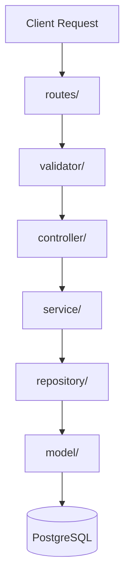

# Server Package Guidelines

ExpressJS backend API with background worker processing.

## Commands
All commands must be executed in the `server/` directory:

| Task | Command | Description |
|------|---------|-------------|
| Install dependencies | `npm install` | Install npm packages |
| Dev (API only) | `npm run dev` | Runs Express API using nodemon |
| Dev (Worker only) | `npm run dev:worker` | Runs BullMQ workers using nodemon |
| Dev (All) | `npm run dev:all` | Runs API and worker concurrently |
| Start (API only) | `npm start` | Run server in production |
| Start (Worker only) | `npm run worker` | Run worker in production |

## Authentication
- **Mechanism**: JSON Web Token (JWT) Bearer Authentication.
- **Header**: `Authorization: Bearer <token>`
- **Verification**: Handled by [auth.middleware.js](file:///d:/workspace/do_an_tot_nghiep/server/src/middlewares/auth.middleware.js) using the `ACCESS_TOKEN` secret key.
- **Context**: Decoded user ID is attached to `req.userId`.

---

## 🏗️ Layered Modular Architecture (Quy định cấu trúc Code)
Để tối ưu hóa Token, tránh sửa đổi nhầm file và duy trì cấu trúc dự án, mọi tính năng/chức năng mới phải được viết đúng Layer quy định trong thư mục `src/modules/<module_name>/`. Viết sai vị trí sẽ dẫn đến lỗi logic hoặc vi phạm kiến trúc hệ thống.

### 1. Model Layer (`src/modules/<module_name>/model/`)
- **Nhiệm vụ**: Định nghĩa bảng (table) và tên các cột (fields) tương ứng trong database.
- **Quy tắc**:
  - Không viết câu lệnh SQL ở đây.
  - Sử dụng object để map tên cột trong Javascript và tên cột thực tế trong DB.
  - Ví dụ mẫu: [user.model.js](file:///d:/workspace/do_an_tot_nghiep/server/src/modules/user/model/user.model.js).

### 2. Repository Layer (`src/modules/<module_name>/repository/`)
- **Nhiệm vụ**: Chịu trách nhiệm trực tiếp giao tiếp với Database (thực thi các câu lệnh SQL query).
- **Quy tắc**:
  - **BẮT BUỘC**: Mọi câu lệnh SQL (SELECT, INSERT, UPDATE, DELETE) phải nằm ở đây. **Tuyệt đối không viết SQL trực tiếp trong Service hay Controller.**
  - Sử dụng đối tượng `client` truyền từ transaction hoặc `pool` từ `@config/database.config` để thực thi query.
  - Ví dụ mẫu: [user.repository.js](file:///d:/workspace/do_an_tot_nghiep/server/src/modules/user/repository/user.repository.js).

### 3. Service Layer (`src/modules/<module_name>/service/` hoặc `services/`)
- **Nhiệm vụ**: Xử lý logic nghiệp vụ (Business Logic).
- **Quy tắc**:
  - Phải gọi qua các phương thức của Repository để lấy/ghi dữ liệu. Không được truy cập trực tiếp database qua SQL query.
  - Sử dụng helper `transaction` khi thực hiện nhiều thao tác ghi dữ liệu liên quan để đảm bảo ACID.
  - Ví dụ mẫu: [auth.service.js](file:///d:/workspace/do_an_tot_nghiep/server/src/modules/auth/service/auth.service.js).

### 4. Controller Layer (`src/modules/<module_name>/controller/`)
- **Nhiệm vụ**: Tiếp nhận Request từ Route, điều hướng qua validator, gọi Service xử lý và trả về Response.
- **Quy tắc**:
  - Không chứa code xử lý business logic, không chứa SQL query.
  - Chỉ làm nhiệm vụ trích xuất tham số từ `req.body`, `req.query`, `req.params`, gọi service tương ứng và trả về JSON response.

### 5. Validator Layer (`src/modules/<module_name>/validator/`)
- **Nhiệm vụ**: Kiểm tra tính hợp lệ của dữ liệu đầu vào trước khi đưa vào controller.

### 6. Routes Layer (`src/modules/<module_name>/routes/`)
- **Nhiệm vụ**: Khởi tạo Express Router của module và cấu hình các endpoints, gắn kèm middleware cần thiết (ví dụ: `verifyToken`).
- **Quy tắc**:
  - Sau khi tạo router của module, phải đăng ký nó vào router tổng tại [routes/index.js](file:///d:/workspace/do_an_tot_nghiep/server/src/routes/index.js).

---

## ⚠️ Quy định nghiêm ngặt phòng ngừa lỗi (Error Prevention)
1. **Không import chéo Repository giữa các module**: Để gọi thông tin/nghiệp vụ của module khác, Service của module hiện tại phải gọi qua Service của module kia. Tránh việc gọi trực tiếp repository của module khác để giữ tính độc lập và phân tách trách nhiệm (Sử dụng DI hoặc import service trực tiếp).
2. **Sử dụng aliases khi import**: Sử dụng alias đã định nghĩa trong `package.json` như `@/config`, `@modules`, `@utils`, `@middlewares`, `@socket` để import thay vì sử dụng đường dẫn tương đối quá sâu (`../../../../`).
3. **Quản lý Transaction**: Bắt buộc dùng `transaction(async (client) => { ... })` khi thực hiện các hoạt động ghi đồng thời vào nhiều bảng hoặc nhiều dòng dữ liệu.
